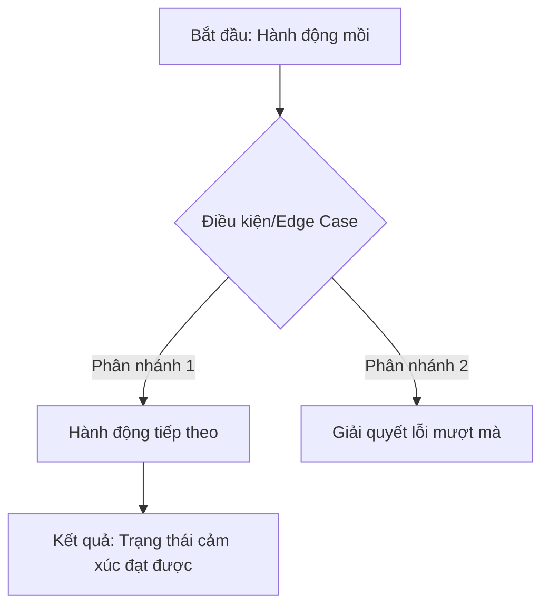

# 📝 UI & UX Specification: [Tên dự án/Màn hình]
- **Link Google Docs:** [Sẽ tự động điền khi chạy lệnh /sync_gdocs]
- **Jira Task:** [Mã Task + Nguồn bài toán]
- **Tóm tắt Yêu cầu:** [Tóm tắt thật ngắn gọn yêu cầu từ PRD hoặc Jira]
- **File Research gốc:** [Tên file RSxx...md chứa Idea và Insight]

---

## 1. Mục tiêu Cảm xúc (Emotional Goal)
*Nhắc lại "Vế Emotion" từ Empathy Strategist để định hướng toàn bộ thiết kế bên dưới.*
- [Tâm trạng mà người dùng phải cảm nhận được ở luồng này]

## 2. Thiết kế Luồng thao tác (UX Flow)
*Sử dụng Mermaid để vẽ luồng tương tác của người dùng. Tuân thủ chuẩn `mermaid_optimization` (Hình thoi cho Rẽ nhánh rủi ro, Hình chữ nhật cho Hành động).*

## 3. Bản thảo Nội dung Giao diện (UI Copywriting Specs)
*Tuân thủ chuẩn `ux_writing_tone` để đảm bảo văn phong thấu cảm, không đổ lỗi cho User khi gặp lỗi.*

| Element (Thành phần) | Nội dung (Copy) | Tone of Voice (Văn phong) | Ghi chú (Rule) |
| :--- | :--- | :--- | :--- |
| Tiêu đề (Header) | [VD: Rất tiếc, kết nối bị gián đoạn] | [VD: Đồng cảm, trấn an] | Giới hạn 50 ký tự |
| Văn bản phụ (Body Text) | [VD: Vui lòng kiểm tra lại Wifi để tiếp tục] | [VD: Rõ ràng, hướng dẫn] | Chỉ ra Next Step |
| Nút chính (Primary CTA)| [VD: Thử lại ngay] | [VD: Hành động nhanh] | Từ khóa động từ |
| Nút phụ (Secondary CTA)| [VD: Trở về màn trước] | [VD: An toàn] | - |

## 4. Các Trường hợp Biên & Luồng lỗi (Edge Cases & Unhappy Paths)
*Tuyệt đối không bỏ sót luồng rủi ro. Cách xử lý lỗi cũng phải mang tính "Con người" (Human-Centric).*

1. **Lỗi Mạng (Network Timeout):**
   - **Cách xử lý:** Hiện Toast/Snackbar hoặc Empty State.
   - **Copywriting:** [Copywriting báo mất mạng chuẩn Empathy]
2. **Không có dữ liệu (Empty State):**
   - **Cách xử lý:** Thay vì để màn hình trắng, hướng dẫn họ cách tạo dữ liệu đầu tiên.
   - **Copywriting:** [Copywriting hướng dẫn bắt đầu]
3. **[Trường hợp rủi ro ngách của riêng Tính năng này]:**
   - **Cách xử lý:** [...]
  - **Copywriting:** [...]
