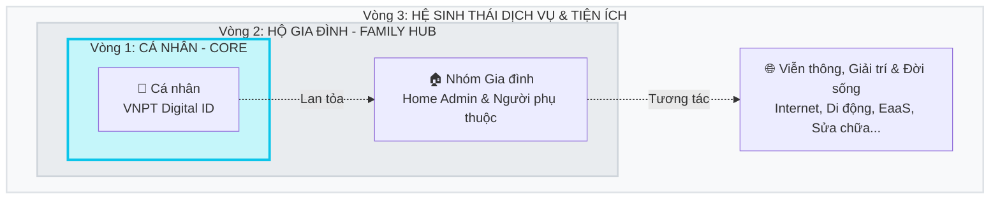

# TÓM TẮT CONCEPT VÀ TRIẾT LÝ SẢN PHẨM EMI OS

Hệ điều hành trải nghiệm số Emi (Omnichannel OS) định hình một bước tiến chiến lược: chuyển đổi từ công cụ quản lý thuê bao viễn thông truyền thống sang một **Trợ lý số cá nhân và gia đình (Family Digital Assistant)**. Emi đại diện cho một thực thể trí tuệ trung tâm, hiện diện liền mạch và giao tiếp thấu cảm trên mọi điểm chạm.

---

## 1. Triết lý Dịch chuyển: "Lấy Con người làm Trung tâm" (Human-Centric)

Sự dịch chuyển lớn nhất của Emi OS là việc từ bỏ mô hình quản lý theo các hợp đồng/số điện thoại rời rạc để tiến tới định danh hợp nhất theo **Chủ thể con người (VNPT Digital ID)**. Mối quan hệ tương tác này được hệ thống mở rộng theo **mô hình vòng tròn đồng tâm**: từ hạt nhân là Cá nhân, liên kết thành Hộ gia đình, và lan tỏa ra toàn bộ Hệ sinh thái Dịch vụ số.

*(Cấu trúc đồng tâm biểu diễn cá nhân ở lõi, được bao bọc bởi gia đình và tiếp cận toàn bộ các dịch vụ số thông qua Trợ lý Emi)*

**Tác động chiến lược:**
*   **Định danh hợp nhất:** Mọi tài sản số, lịch sử, điểm thưởng đều gắn với một "Căn cước công dân số" duy nhất.
*   **Thấu hiểu vai trò:** Phân tách rõ ràng luồng phục vụ cho **Mass** (khách hàng đại chúng), **Home Admin** (người quản lý), **Home Dependents** (người phụ thuộc - người già/trẻ em).

Hệ quả tất yếu của triết lý này là **Hành trình Trải nghiệm Không rào cản (Frictionless Journey)**. Thay vì bắt buộc người dùng phải tạo tài khoản hay đăng nhập ngay từ đầu, Emi OS được thiết kế như một không gian mở, luôn chào đón mọi khách hàng. Giao diện và các tính năng sẽ tự động điều chỉnh linh hoạt tùy theo mức độ hệ thống "hiểu" khách hàng đến đâu. Mục tiêu cao nhất là mang lại sự thoải mái, tiết kiệm thời gian và cung cấp những đặc quyền xứng đáng nhất:
*   **Tự do Khám phá (Dành cho Khách hàng mới/vãng lai):** 
    *   *Trải nghiệm:* Ứng dụng hoạt động mượt mà như một cửa hàng trực tuyến hiện đại. Khách hàng có thể thoải mái xem các ưu đãi, tìm hiểu gói cước và đặt mua sim ngay lập tức mà không cần phải trải qua các bước đăng ký tài khoản phiền phức. 
    *   *Lợi ích:* Tiết kiệm thời gian tuyệt đối, xóa bỏ rào cản tâm lý e ngại ban đầu, giúp khách hàng nhanh chóng tận hưởng dịch vụ mình cần.

*   **Được Chăm sóc Chủ động (Dành cho Khách hàng thiếu thông tin định danh):** 
    *   *Trải nghiệm:* Hệ thống vẫn mở quyền cho khách hàng sử dụng trọn vẹn các tiện ích gắn với dịch vụ VNPT mà họ đang sở hữu thực tế. Ví dụ: Dù khách hàng dùng số điện thoại Viettel để đăng nhập, nhưng nếu ở nhà có mạng Internet VNPT, khách hàng vẫn có thể tự thao tác đổi mật khẩu Wifi, báo hỏng mạng... trơn tru như bình thường. 
    *   *Lợi ích:* Hệ thống sẽ khéo léo khuyến khích bổ sung định danh (Căn cước) để được trải nghiệm cá nhân hóa sâu hơn. Ngay khi định danh thành công, hệ thống sẽ tự động rà soát toàn mạng xem khách hàng còn đang sở hữu dịch vụ VNPT nào khác không, từ đó tiến hành "hợp nhất" mọi thông tin để khách hàng quản trị tập trung và nhận về nhiều ưu đãi cộng thêm hơn.

*   **Tận hưởng Đặc quyền (Dành cho Khách hàng đã định danh VNPT Digital ID):** 
    *   *Trải nghiệm:* Giá trị lớn nhất của việc định danh (gắn với CCCD) là sự **"Hợp nhất tài sản"**. Toàn bộ các thuê bao rời rạc mà khách hàng đang đứng tên đều được tự động gom về quản lý tập trung. Điểm ưu việt là khách hàng có thể dùng đa dạng phương thức đăng nhập (sử dụng bất kỳ số điện thoại nào trong số đó), hệ thống đều thông minh nhận diện và dẫn thẳng về đúng một tài khoản gốc duy nhất.
    *   *Lợi ích:* Việc định danh (KYC) không còn là một thủ tục bắt buộc phiền hà, mà trở thành một **"Đặc quyền số"**. Đặc quyền này giúp khách hàng giải phóng hoàn toàn khỏi gánh nặng phải ghi nhớ nhiều tài khoản rời rạc, đồng thời làm chủ và kiểm soát toàn diện mọi tài sản viễn thông cá nhân một cách mượt mà và an toàn nhất.

---

## 2. Kiến trúc và Triết lý Giao tiếp: "Hội thoại & Thấu cảm"

Để Emi giao tiếp hiệu quả, hệ thống được thiết kế với một **Triết lý thấu cảm** (phần hồn) và được biểu diễn thông qua **Kiến trúc tương tác kép** (phần xác).

### 💬 Triết lý Giao tiếp: Thấu hiểu Ngữ cảnh (Context-Aware)
Trợ lý Emi không hoạt động như một cỗ máy thông báo thụ động, mà mang **nhân cách thấu cảm (Persona)**:
1.  **Đúng Người - Đúng Thời Điểm (Micro-moments):** Emi không bắt ép, mà gợi ý theo ngữ cảnh thực tế. Thay vì gửi tin nhắc nạp thẻ ngẫu nhiên, Emi tự động đưa ra gợi ý đúng khoảnh khắc khách hàng vừa dùng hết dung lượng, hoặc nhắc gói Roaming khi phát hiện khách đến sân bay.
2.  **Bán Giá trị, Không bán Thông số:** Cách viết nội dung (UX Writing) thay đổi từ việc trưng bày "Gói 30GB băng thông 100Mbps" sang "Gói data tối ưu để xem phim cuối tuần". 
3.  **Ngôn ngữ No-Jargon (Phi Thuật Ngữ):** Xóa bỏ triệt để các cảnh báo mã lỗi kỹ thuật khó hiểu. Emi giao tiếp bằng ngôn ngữ đời thường, xoa dịu sự cố và cung cấp ngay nút "Bấm để Emi xử lý" (Action-oriented).
4.  **Bảo trợ & Ân cần (Zero-Tech):** Đơn giản hóa tối đa các thao tác công nghệ phức tạp (VD: Cấu hình Router, Chặn web độc hại) để mọi thành viên đều được bảo vệ an toàn mà không cần kiến thức kỹ thuật.

### 📱 Cấu trúc Giao diện: Tương tác Kép (Nội tại & Ngoại vi)
Dựa trên triết lý thấu cảm, màn hình ứng dụng được chia làm hai luồng thông tin song song, giúp người dùng vừa kiểm soát tốt bản thân, vừa kết nối với thế giới bên ngoài:

**1. Lớp Thông tin Nội tại: Widget-Driven (Từ Khách hàng -> App)**
Widget là tấm gương phản chiếu **trạng thái sử dụng dịch vụ hiện tại** của chính khách hàng (Internal Information):
*   **Hiển thị theo thực tế:** Chỉ xuất hiện dựa trên các dịch vụ khách hàng đang sở hữu. Ví dụ: Giấu Widget quản lý Data nếu khách chưa có SIM, hiện Widget "Lịch hẹn thợ" khi sắp đến giờ sửa mạng.
*   **Hành động nhanh (Quick Action):** Cung cấp thông tin dạng thẻ (Bento Box) để khách hàng "quét" nhanh trong 0.5 giây và thực hiện thao tác quản trị ngay lập tức.
*   **Tương tác vòng đời:** Tự động phình to cảnh báo khi sắp hết hạn gói cước, hoặc tạo hiệu ứng chúc mừng khi nạp tiền thành công.

**2. Lớp Thông tin Ngoại vi: Contextual Feeds (Từ Emi -> Khách hàng)**
Feeds là kênh giao tiếp chủ động, nơi Trợ lý Emi **"speak out"** để mang thông tin từ bên ngoài (External Information) tiếp cận khách hàng:
*   **Chủ động Gợi mở:** Nơi Emi trò chuyện, cập nhật tin tức giải trí, hoặc giới thiệu ưu đãi mới nhất từ hệ sinh thái VNPT.
*   **Thuật toán chống Spam (Tỷ lệ 3-1-1):** Emi kiểm soát tỷ lệ xuất hiện nghiêm ngặt (3 bài Hữu ích : 1 bài Khám phá : 1 bài Bán hàng) để không làm phiền người dùng.
*   **Cá nhân hóa theo Tương tác (Reaction-based):** Tương tự mạng xã hội, Emi sẽ chủ động học hỏi mức độ phản hồi của khách hàng để sắp xếp luồng tin. Các nội dung được quan tâm (nhấn xem, thả tim) sẽ được ưu tiên hiển thị trước; ngược lại, các chủ đề bị bỏ qua hoặc "không thích" sẽ dần bị loại bỏ khỏi luồng tin.

---

## 3. Không giới hạn Tiện ích: Trở thành "Trợ lý Gia đình" toàn diện

Emi OS không chỉ phục vụ các dịch vụ viễn thông cốt lõi của VNPT. Ứng dụng được thiết kế để dễ dàng liên kết với các đối tác bên ngoài, biến MyVNPT thành một trung tâm giải quyết mọi nhu cầu thiết yếu của gia đình (Family Hub):

*   **Tích hợp Dịch vụ Đời sống:** Dễ dàng bổ sung các tiện ích sinh hoạt hàng ngày như: gọi thợ sửa chữa điện nước, mua sắm bảo hiểm, thanh toán học phí, y tế, hay đặt vé du lịch. Khách hàng không cần phải cài đặt thêm nhiều ứng dụng khác nhau.
*   **Kết nối Đa chiều qua "Ứng dụng thu nhỏ" (Mini-app):** 
    * *Đưa đối tác vào MyVNPT:* Nhúng thẳng các dịch vụ tiện ích của đối tác vào MyVNPT để khách hàng sử dụng ngay trọn gói các dịch vụ.
    * *Đưa VNPT đi muôn nơi:* Các dịch vụ của VNPT cũng được "đóng gói" gọn nhẹ để xuất hiện trên các nền tảng phổ biến khác (như Zalo, App Ngân hàng). Khách hàng ở đâu, dịch vụ VNPT hiện diện ở đó.
*   **Thấu hiểu để Chăm sóc tốt hơn:** Nhờ việc liên kết với nhiều đối tác, Trợ lý Emi càng hiểu rõ hơn nhu cầu của gia đình, từ đó đưa ra các gợi ý cực kỳ đúng lúc. Chẳng hạn, khi khách hàng vừa đăng ký gói mạng quốc tế, Emi sẽ tự động gợi ý mua bảo hiểm trễ chuyến bay để chuẩn bị kỹ càng cho chuyến đi.

> **Tổng kết:** 
> Concept mới của MyVNPT (Emi OS) không chỉ là sự thay đổi lớp vỏ giao diện, mà là một bước chuyển mình sâu sắc về hệ tư duy: Chuyển từ "Cung cấp Dịch vụ Viễn thông" sang **"Chăm sóc Cuộc sống số"**. Nhờ luồng dữ liệu hợp nhất định danh, cách giao tiếp thấu cảm và một hệ sinh thái tiện ích mở rộng không giới hạn, Emi mang đến một trải nghiệm tinh tế, tự nhiên và trọn vẹn nhất.
