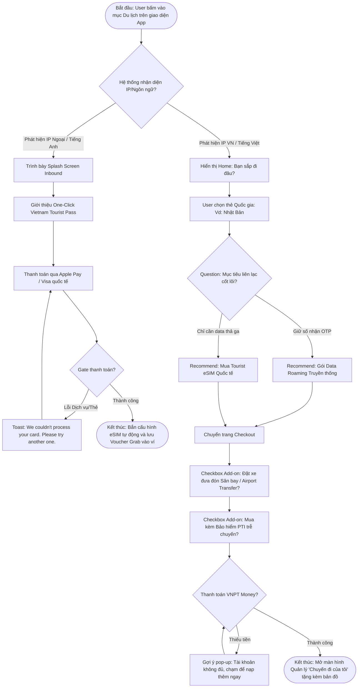

# Specs & Copywriting: Phân hệ Du lịch (Travel Hub) - DigiShop

**🔗 Trích lục Research Insights Tham khảo:**
1. [Báo cáo UX Benchmark Thị trường](file:///Users/Shared/Previously%20Relocated%20Items/Security/Documents/GDS-MyVNPT/knowledge%20base/research/UX_Benchmark/UXB_001_Travel_Hub.md)
2. [Chiến lược Thấu cảm & Phân tích Nỗi đau](file:///Users/Shared/Previously%20Relocated%20Items/Security/Documents/GDS-MyVNPT/knowledge%20base/research/BAU_SIP_Research_001_Travel_Hub.md)

---

## 1. UX Flow (Luồng chức năng Định hướng)
Sơ đồ hệ thống thể hiện luồng "Cửa ngõ" rẽ nhánh cá nhân hóa ngay từ những giây đầu tiên.

---

## 2. UI Copywriting & Text (Chuẩn Empathy Tone)

Điểm lưu ý: Mọi wording phải toát lên sự "An tâm" (Emotion: Total Relief) và hướng dẫn hành động (Action-Oriented).

| Element | Nội dung (Copy) | Ghi chú (Rule) |
| :--- | :--- | :--- |
| **Header (Inbound)** | Welcome to Vietnam! Stay connected & Ride safe. | Khơi gợi cảm giác thân thuộc, đánh bạt nỗi sợ scam taxi và mất mạng mộc mạc nhất. |
| **Nút CTA (Inbound)** | Get Tourist Pass - $12 | Nêu rõ sản phẩm đang trọn gói, kèm cụm giá rõ ràng (No hidden fee). |
| **Question (Outbound)**| Để mình gợi ý gói cước chuẩn nhất cho bạn nhé! Bạn cần... 👉 Giữ số để nhận OTP / Gọi về VN 👉 Chỉ cần Data lướt Tiktok giá siêu tiết kiệm | Đưa kỹ thuật Roaming/eSIM về ngôn ngữ đời thường (Use-case level). |
| **Khuyên dùng Add-on** | Bạn đã lo xong vé mạng. Thêm 95.000đ để an tâm trọn vẹn nếu lỡ chuyến bay nhé? | Upsell nhẹ nhàng dựa trên nỗi sợ thất lạc chuyến đi. |
| **Add-on Đặt xe** | Hết cảnh chờ taxi mỏi mòn. Đặt trước xe đưa đón sân bay 2 chiều cực nhàn! | Giải quyết nỗi ám ảnh gọi xe tại sân bay lúc sáng sớm hoặc đêm muộn. |
| **Lỗi (Thanh toán hỏng)**| Giao dịch gián đoạn. Bạn kiểm tra lại wifi hoặc số dư thẻ nhé! | Không đổ lỗi "Bạn nhập sai", báo lỗi kèm hướng dẫn hành động. |
| **Lỗi (Hệ thống sập)** | Hệ thống đang nghỉ ngơi một chút. Bạn quay lại sau 5 phút nhé! | Thể hiện sự khiêm tốn, tránh dùng biệt ngữ System Error 500. |

---

## 3. Tech Specs & Edge Cases
### Quy tắc Nghiệp vụ (Business Rules):
- **Localization:** Mặc định lấy theo locale của thiết bị. Nếu máy khách dùng Tiếng Anh thì force App hiển thị tiếng Anh và đập ngay banner luồng Inbound lên trang chủ.
- **Thanh toán Inbound:** Không yêu cầu lập ví VNPT Money, PHẢI cho luồng Checkout Guests hỗ trợ thẻ Visa quốc tế / Apple Pay.

### Xử lý Ngoại lệ (Edge Cases):
- **Trạng thái Trống (Empty State):** Khi khách bấm vào "Chuyến đi của tôi" mà chưa mua gì -> Hiển thị minh họa 1 vali trống kèm nút `"Khám phá các điểm đến hot nhất mùa này"`.
- **Lỗi quét eSIM:** Nếu có lỗi kỹ thuật khi cấp UUID eSIM cho máy người dùng -> Gửi luôn cấu hình thủ công vào Email đăng ký và hướng dẫn nhập mã code tay.
