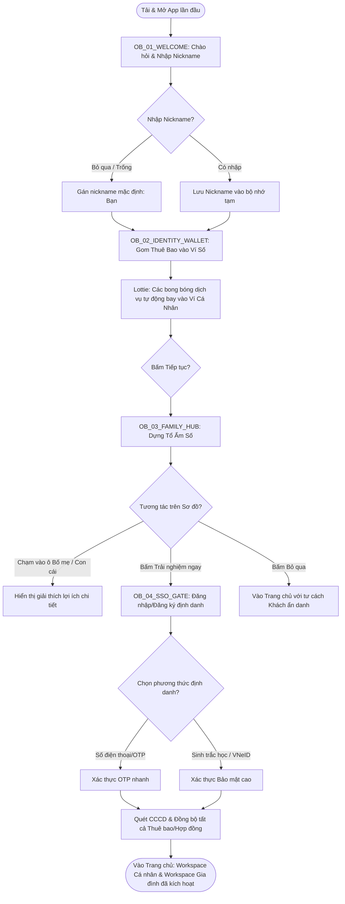

# Specs & Copywriting: Luồng Onboarding Nhập vai Tương tác (Interactive Storytelling) - Emi OS MyVNPT

**🔗 Trích lục Tài liệu Đề xuất:**
*   [Đề xuất Phương án Onboarding ban đầu](file:///Users/Shared/Previously%20Relocated%20Items/Security/Documents/GDS-MyVNPT/knowledge%20base/specs/PROPOSAL_Onboarding_Flow_EmiOS.md)
*   [Định hướng Chiến lược Danh tính & Hộ gia đình](file:///Users/Shared/Previously%20Relocated%20Items/Security/Documents/GDS-MyVNPT/knowledge%20base/background/Tong_hop_Dinh_huong_User_va_Family_Concept.md)

---

## 1. UX Flow (Luồng chức năng Định hướng)

Sơ đồ thể hiện luồng đi của người dùng từ khi mở ứng dụng lần đầu, tương tác qua các bước giáo dục khái niệm của trợ lý Emi, cho đến khi đăng nhập và đồng bộ hóa thành công.

---

## 2. Chi tiết các màn hình (Screen-by-Screen Specification)

### Màn hình 1: Chào hỏi & Nhập Nickname (`OB_01_WELCOME`)
*   **Visual & UI Layout:**
    *   **Nền (Background):** Chế độ tối mặc định (Dark Mode). Sử dụng gradient động dịu nhẹ từ xanh chàm (Deep Indigo - `#0D0D26`) sang tím sẫm (Dark Violet - `#1F1A3A`).
    *   **Nhân vật trung tâm:** Mascot Trợ lý Emi (dạng 3D rendered hoặc Lottie animation chất lượng cao) ở nửa trên màn hình, đang vẫy tay chào và nháy mắt tinh nghịch. Emi phát sáng nhẹ (glow effect) màu xanh mint.
    *   **Input Box:** Thẻ nhập text dạng Glassmorphism (độ mờ 15%, viền mỏng phát sáng nhẹ màu trắng bạc), bo góc `16px`. Nằm ở nửa dưới màn hình.
    *   **Typography:** Tiêu đề font Outfit/Inter, size `24px`, bold. Text-body size `15px`, color `#E2E8F0` (xám sáng).
*   **Micro-interactions & Animations:**
    *   Khi vừa vào màn hình, Emi tự động phát animation vẫy tay (Lottie frame 0-60) kèm hiệu ứng chữ chạy từ từ (typewriter effect) cho lời thoại.
    *   Khi người dùng chạm vào Input Box, bàn phím hệ thống trượt lên, Emi chuyển sang trạng thái animation "hơi nghiêng đầu lắng nghe".
    *   Nút "Tiếp tục" ẩn dưới bàn phím hoặc trượt lên phía trên bàn phím. Nếu để trống, nút hiển thị chữ "Bỏ qua" màu xám. Nếu người dùng gõ ít nhất 1 ký tự, nút ngay lập tức chuyển trạng thái sang hoạt động (Active), chuyển sang màu xanh mint sáng (`#00F2FE`) và hiển thị chữ "Tiếp tục" màu đen sẫm.
*   **UX Copywriting (Emi Speak-out):**
    *   *Tiêu đề lời thoại:* *"Xin chào! Mình là Emi, trợ lý số của bạn."*
    *   *Nội dung thoại:* *"Từ nay chúng mình sẽ đồng hành cùng nhau nhé. Emi nên gọi bạn là gì để thân thiết hơn nhỉ?"*
    *   *Placeholder trong ô nhập:* *"Tên hoặc biệt danh của bạn..."*
    *   *Nút hành động:* `[Bỏ qua]` (trạng thái trống) -> `[Tiếp tục]` (khi đã nhập chữ).

---

### Màn hình 2: Hợp nhất Thuê bao - Hoạt cảnh Ví Số (`OB_02_IDENTITY_WALLET`)
*   **Visual & UI Layout:**
    *   **Trạng thái Emi:** Emi đứng góc trên bên trái màn hình dưới dạng một avatar nhỏ dễ thương, biểu cảm vui vẻ.
    *   **Trung tâm màn hình:** Một mô hình chiếc "Ví kỹ thuật số" (Digital Wallet) thiết kế 3D bóng bẩy nằm mở sẵn ở giữa.
    *   **Xung quanh ví:** Các "bong bóng năng lượng" (Energy Bubbles) trôi lơ lửng, mỗi bong bóng chứa một icon dịch vụ vẽ tay màu neon sắc nét:
        *   Bong bóng 1: Icon Điện thoại (SIM VinaPhone).
        *   Bong bóng 2: Icon Sóng Wifi (Internet cáp quang FiberVNN).
        *   Bong bóng 3: Icon Màn hình TV (Truyền hình MyTV).
        *   Bong bóng 4: Icon Đồng xu (Điểm thưởng Loyalty VPoint).
*   **Micro-interactions & Animations:**
    *   **Hiệu ứng Gom (Consolidation Animation):** Khi màn hình hiển thị, các bong bóng tự động bị hút tụ về phía chiếc Ví da số theo quỹ đạo đường cong (Lottie animation). Khi mỗi bong bóng chạm ví, chiếc ví sẽ phình nhẹ và phát ra hiệu ứng sóng xung kích phát sáng (Ripple glow) màu tím/mint kèm theo rung nhẹ thiết bị (haptic feedback nhẹ dạng *success*).
    *   Sau khi hoàn tất gom (khoảng 1.5 giây), chiếc ví tự động đóng lại, trên mặt ví hiện lên khắc chìm tên Nickname của người dùng vừa nhập ở màn 1 (Ví dụ: *"Ví số của Minh An"*).
    *   Nút "Tiếp tục" ở dưới chân màn hình sáng lên (Pulse animation nhẹ) để mời gọi tương tác.
*   **UX Copywriting (Emi Speak-out):**
    *   *Lời thoại Emi:* *"Tuyệt vời, chào [Minh An]! Emi biết bạn có rất nhiều dịch vụ VNPT ở khắp nơi. Thay vì quản lý rời rạc bằng mật khẩu và mã hợp đồng khó nhớ, Emi sẽ tự động gom hết tất cả vào 'Chiếc ví số' duy nhất gắn liền với bạn. Một tài khoản, thấy trọn gói!"*
    *   *Nút hành động:* `[Tiếp tục nào]`

---

### Màn hình 3: Dựng Tổ Ấm Số - Family Hub (`OB_03_FAMILY_HUB`)
*   **Visual & UI Layout:**
    *   **Nửa trên:** Trợ lý Emi bay lơ lửng bên cạnh một mô hình ngôi nhà 3D cách điệu phát sáng màu ấm áp (Tượng trưng cho Tổ ấm/Hộ gia đình).
    *   **Nửa dưới:** Một sơ đồ gia đình kết nối dạng sơ đồ tư duy (Mindmap). Trung tâm là avatar của chính User (`OB_01`), tỏa ra 3 nhánh trống:
        *   Nhánh 1: Avatar placeholder nét đứt, nhãn *"Bố mẹ (ở quê)"*.
        *   Nhánh 2: Avatar placeholder nét đứt, nhãn *"Con cái (chia sẻ data)"*.
        *   Nhánh 3: Avatar placeholder nét đứt, nhãn *"Thành viên khác"*.
*   **Micro-interactions & Animations:**
    *   Sơ đồ gia đình hiển thị với hiệu ứng xuất hiện từ từ (fade-in và scale-up nhẹ các nút nhánh).
    *   Khi người dùng chạm thử vào một nhánh trống (Ví dụ: *Bố mẹ*), một tooltip Glassmorphism nhỏ dạng chat bubble sẽ hiện ra từ nhánh đó để giải thích tiện ích cụ thể (Ví dụ: *"Giúp bố mẹ đóng cước Internet và báo hỏng mạng thay chỉ bằng 1 chạm"*).
    *   Khi chạm ngoài, tooltip tự động đóng lại.
    *   Nút CTA chính `"Dựng tổ ấm số ngay"` sáng nổi bật màu xanh mint ở dưới. Nút phụ `"Vào app trải nghiệm trước"` hiển thị dạng text link màu xám tinh tế phía dưới cùng để tôn trọng quyền lựa chọn của khách hàng.
*   **UX Copywriting (Emi Speak-out):**
    *   *Lời thoại Emi:* *"Gia đình là để sẻ chia! Bạn có muốn cùng Emi tạo một không gian chung để dễ dàng nạp thẻ, đóng tiền mạng hộ bố mẹ và chia sẻ Data tốc độ cao cho con cái không?"*
    *   *Tooltip khi bấm vào nhánh Bố Mẹ:* *"Đóng tiền mạng hộ & tạo ticket báo sửa mạng thay bố mẹ ở quê khi gặp sự cố."*
    *   *Tooltip khi bấm vào nhánh Con Cái:* *"Chia sẻ gói cước Data dùng chung và kích hoạt Family Safe chặn web độc hại."*
    *   *Nút hành động chính:* `[Dựng tổ ấm số ngay]`
    *   *Nút hành động phụ:* `[Để sau, vào trang chủ]`

---

### Màn hình 4: Đăng nhập/Đăng ký Định danh số (`OB_04_SSO_GATE`)
*   **Visual & UI Layout:**
    *   **Nền:** Chuyển đổi mượt mà (transition) sang màn hình có màu nền sáng sủa hơn một chút để tạo sự tin cậy, an tâm bảo mật.
    *   **Trung tâm:** Biểu tượng lá chắn bảo mật khóa vân tay kết hợp logo VNPT Digital ID phát sáng nhẹ.
    *   **Các lựa chọn đăng nhập:** 3 nút bấm lớn xếp dọc theo thứ tự ưu tiên trải nghiệm:
        *   Nút 1: Đăng nhập tự động qua mạng di động 4G (nếu phát hiện SIM VinaPhone) hoặc Nhập số điện thoại nhận OTP nhanh. Màu xanh gradient.
        *   Nút 2: Liên kết tài khoản VNeID (Biểu tượng VNeID chính thức).
        *   Nút 3: Đăng nhập bằng Sinh trắc học (FaceID/Vân tay) nhanh.
*   **Micro-interactions & Animations:**
    *   Hiệu ứng chuyển cảnh mượt mà giữa các bước xác thực.
    *   Khi hệ thống đang xác thực/quét thông tin CCCD ngầm để gom dịch vụ, hiển thị một vòng tròn xoay radar quét xung quanh Avatar cá nhân của người dùng, tượng trưng cho việc Emi đang đi quét và kết nối tài sản số.
*   **UX Copywriting (Emi Speak-out):**
    *   *Lời thoại Emi:* *"Để bảo vệ an toàn cho Ví số và Không gian gia đình của bạn, hãy cùng Emi xác thực danh tính nhanh bằng một trong các phương thức bảo mật dưới đây nhé!"*
    *   *Nút hành động 1:* `[Xác thực nhanh qua Số điện thoại]`
    *   *Nút hành động 2:* `[Đăng nhập an toàn bằng VNeID]`
    *   *Nút hành động 3:* `[Sử dụng FaceID/Sinh trắc học]`

---

## 3. UI Copywriting Matrix (Chuẩn Empathy Tone & Emi Persona)

Bảng tổng hợp tất cả các đoạn văn bản (text elements) xuất hiện trong luồng Onboarding. Toàn bộ ngôn từ tuân thủ nghiêm ngặt nguyên tắc **Emi Speak-out** (đối thoại 1-1, ấm áp, bảo trợ) và **No-Jargon** (loại bỏ thuật ngữ kỹ thuật).

| Screen ID | Element ID | UI Text Content (Copy) | Loại Text / Trạng thái | Ghi chú thiết kế (Rules) |
| :--- | :--- | :--- | :--- | :--- |
| **OB_01** | `TXT_Title` | *"Xin chào! Mình là Emi, trợ lý số của bạn."* | Tiêu đề lớn (H1) | Font Outfit, size 24px. Tạo cảm giác chào đón nồng nhiệt. |
| **OB_01** | `TXT_Body` | *"Từ nay chúng mình sẽ đồng hành cùng nhau nhé. Emi nên gọi bạn là gì để thân thiết hơn nhỉ?"* | Nội dung phụ (H2) | Dùng cấu trúc hỏi thân mật để thu thập Nickname cá nhân hóa. |
| **OB_01** | `IPT_Nickname`| *"Tên hoặc biệt danh của bạn..."* | Placeholder trong Input | Text mờ màu xám nhạt `#A0AEC0`. |
| **OB_01** | `BTN_Submit` | `[Bỏ qua]` / `[Tiếp tục]` | Nút CTA chính | Tự động chuyển đổi màu sắc và text khi người dùng bắt đầu gõ. |
| **OB_02** | `TXT_Body` | *"Chào {Nickname}! Emi biết bạn có rất nhiều dịch vụ VNPT ở khắp nơi. Thay vì quản lý rời rạc bằng mật khẩu và mã hợp đồng khó nhớ, Emi sẽ tự động gom hết tất cả vào 'Chiếc ví số' duy nhất gắn liền với bạn. Một tài khoản, thấy trọn gói!"* | Nội dung thoại của Emi | Sử dụng biến `{Nickname}` thu thập từ màn 1. Tránh từ "thuê bao", dùng từ "dịch vụ". |
| **OB_02** | `BTN_Next` | `[Tiếp tục nào]` | Nút CTA chính | Màu xanh mint sáng phát sáng nhẹ để kích thích bấm. |
| **OB_03** | `TXT_Body` | *"Gia đình là để sẻ chia! Bạn có muốn cùng Emi tạo một không gian chung để dễ dàng nạp thẻ, đóng tiền mạng hộ bố mẹ và chia sẻ Data tốc độ cao cho con cái không?"* | Nội dung thoại của Emi | Đánh thẳng vào usecase "chia sẻ" và "chăm sóc" người thân. |
| **OB_03** | `TIP_Parents` | *"Đóng tiền mạng hộ & tạo ticket báo sửa mạng thay bố mẹ ở quê khi gặp sự cố."* | Tooltip thông tin | Hiện lên dạng popover bong bóng chat khi chạm vào ô "Bố mẹ". |
| **OB_03** | `TIP_Kids` | *"Chia sẻ gói cước Data dùng chung và kích hoạt Family Safe chặn web độc hại."* | Tooltip thông tin | Hiện lên dạng popover bong bóng chat khi chạm vào ô "Con cái". |
| **OB_03** | `BTN_Family` | `[Dựng tổ ấm số ngay]` | Nút CTA chính | Kích thích hành động tạo nhóm. |
| **OB_03** | `BTN_Skip` | `[Để sau, vào trang chủ]` | Link phụ (Secondary CTA) | Định dạng chữ gạch chân màu xám để giảm sự chú ý so với CTA chính. |
| **OB_04** | `TXT_Body` | *"Để bảo vệ an toàn cho Ví số và Không gian gia đình của bạn, hãy cùng Emi xác thực danh tính nhanh bằng một trong các phương thức bảo mật dưới đây nhé!"* | Lời thoại Emi | Sử dụng từ "bảo vệ an toàn" để tạo lòng tin trước khi yêu cầu đăng nhập. |
| **OB_04** | `ERR_Auth` | *"Kết nối gián đoạn một chút. Emi chưa xác thực được danh tính của bạn. Bạn kiểm tra lại mạng hoặc thử phương thức khác nhé!"* | Thông báo lỗi xác thực | Áp dụng triết lý No-Jargon: Không báo mã lỗi hệ thống, chỉ rõ cách khắc phục. |

---

## 4. Tech Specs, Edge Cases & Business Rules

### Quy tắc Nghiệp vụ (Business Rules)
1.  **Tính nhất quán của Nickname:** Nickname người dùng nhập ở `OB_01` sẽ được lưu tạm vào bộ nhớ đệm ứng dụng (caching session). Sau khi người dùng đăng nhập định danh số thành công ở `OB_04`, nickname này sẽ được ghi đè vào profile chính thức trên cơ sở dữ liệu.
2.  **Cơ chế quét CCCD ngầm:** Hệ thống sử dụng số định danh từ VNPT Digital ID (sau khi đăng nhập ở `OB_04`) để tự động truy vấn chéo (cross-query) các hệ thống BSS để tìm kiếm toàn bộ các dịch vụ (SIM, Internet Fiber, MyTV) do số định danh đó đứng tên chủ sở hữu, tự động hiển thị đầy đủ trên màn hình trang chủ mà không cần bắt user khai báo mã hợp đồng.

### Xử lý Ngoại lệ & Ca đặc biệt (Edge Cases)
*   **Người dùng bỏ qua việc nhập Nickname ở Màn 1:**
    *   *Cách xử lý:* Nếu bấm `[Bỏ qua]`, hệ thống gán mặc định biến `{Nickname}` = *"bạn"*. Lời thoại ở màn hình sau sẽ tự động co giãn: *"Chào bạn! Emi biết bạn..."* thay vì *"Chào [Minh An]! Emi biết bạn..."*.
*   **Thiết bị màn hình nhỏ (Ví dụ: iPhone SE, dòng Android cũ):**
    *   *Cách xử lý:* Khi bàn phím hệ thống xuất hiện ở Màn 1, toàn bộ các thành phần visual (Mascot Emi) tự động thu nhỏ (scale-down) 50% và trượt nhẹ lên phía trên để đảm bảo ô nhập Nickname và nút CTA không bị che khuất và người dùng không phải cuộn màn hình.
*   **Lỗi mất kết nối mạng giữa chừng:**
    *   *Cách xử lý:* Hiển thị màn hình trạng thái lỗi với Trợ lý Emi cầm bảng thông báo: *"Mạng bị nghẹn mất rồi. Bạn kiểm tra lại kết nối Wifi/4G hoặc bấm nút dưới đây để thử lại cùng Emi nhé!"* kèm nút `[Thử lại]`. Không sử dụng các trang báo lỗi trắng hoặc mã lỗi kỹ thuật 503/404.
*   **Khách hàng không muốn định danh số ở bước cuối (`OB_04`) mà muốn trải nghiệm trước:**
    *   *Cách xử lý:* Khi bấm `[Để sau, vào trang chủ]` ở `OB_03`, ứng dụng sẽ đưa người dùng vào Trang chủ với trạng thái **"Khách ẩn danh" (Anonymous User)**. Lúc này, giao diện sẽ ẩn các thông số tài khoản và hiển thị dưới dạng cửa hàng DigiShop (giới thiệu gói cước, mua sắm SIM). Khi khách thực hiện một thao tác cần quyền hạn (Ví dụ: Đăng ký gói), Emi sẽ kích hoạt lại luồng xác thực `OB_04`.

---

*Bản đặc tả kỹ thuật này đã sẵn sàng để chuyển giao cho UI Designer và Đội ngũ lập trình.*
