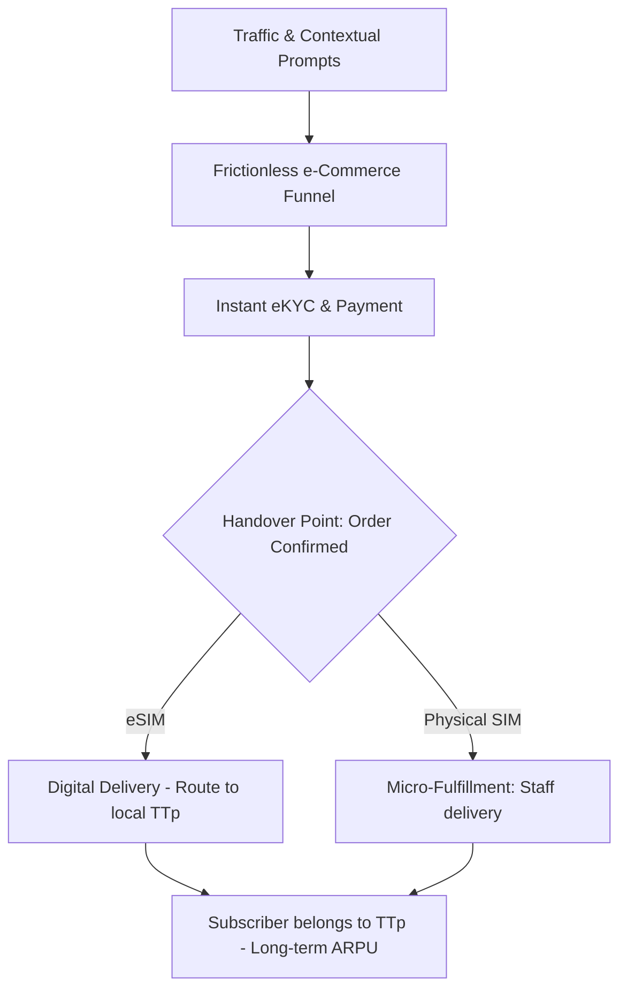
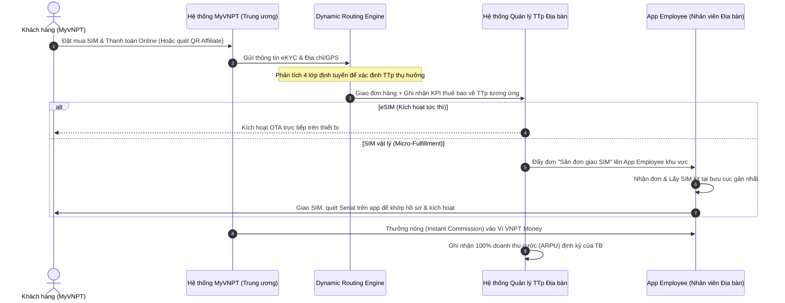
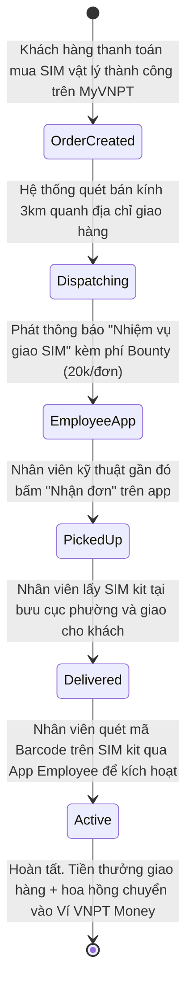
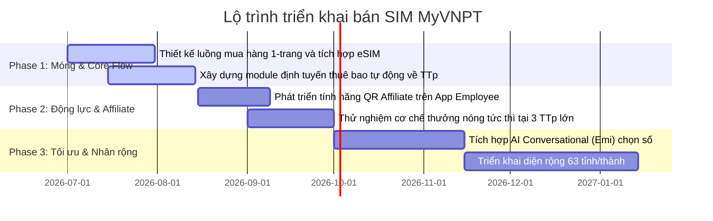

# PHƯƠNG ÁN CHIẾN LƯỢC: TỔ CHỨC BÁN SIM TỰ ĐỘNG HÓA QUA SIÊU ỨNG DỤNG MYVNPT (EMI OS)
*Tài liệu tư vấn giải pháp chuyển đổi mô hình kinh doanh SIM theo tư duy Startup và tối ưu hóa nguồn lực địa bàn*

---

## 1. Tư duy cốt lõi: Nhìn MyVNPT dưới lăng kính Startup số

Để đột phá trong việc bán SIM qua MyVNPT, chúng ta cần thay đổi tư duy từ một **"kênh số hỗ trợ thủ tục viễn thông"** sang một **"Growth Platform độc lập hoạt động theo mô hình Startup"**.



### Các chỉ số Startup cần tối ưu hóa:
1. **CAC (Customer Acquisition Cost) gần như bằng 0:** Tận dụng lưu lượng truy cập tự nhiên (Organic Traffic) khổng lồ hiện tại của MyVNPT từ khách hàng đang sử dụng Fiber/MyTV hoặc tra cứu cước để chuyển đổi sang thuê bao di động.
2. **LTV (Lifetime Value) cao:** Bán SIM không chỉ lấy cước di động đơn thuần, mà là bước đệm để tích hợp vào **Family Hub (Gói cước gia đình dùng chung data)**, khóa chặt khách hàng trong hệ sinh thái VNPT.
3. **Conversion Rate (CVR) tối đa nhờ Frictionless UX:**
   * **Zero-Login Wall:** Cho phép lướt chọn số đẹp, xem gói cước mà không bắt buộc đăng nhập ngay. Chỉ yêu cầu thông tin khi eKYC và thanh toán.
   * **One-Page Checkout:** Quy trình chọn SIM -> chọn gói -> điền thông tin -> thanh toán được thiết kế trên 1 màn hình duy nhất (tương tự Shopee), loại bỏ 80% thủ tục điền form viễn thông truyền thống.

---

## 2. Quy trình bán hàng: Tự động hóa bằng Công nghệ (Tech-First) thay vì Con người

Mô hình telesales truyền thống hoặc thuê ngoài (outsourcing) tốn kém nhiều chi phí quản lý và dễ gây phiền hạ cho khách hàng. Phương án tối ưu là sử dụng **Trí tuệ nhân tạo và Tự động hóa theo ngữ cảnh**.

### 2.1. Tiếp cận và Chốt đơn Tự động (Contextual Commerce & AI Conversational)
* **Gợi ý cá nhân hóa dựa trên sự kiện (Micro-moments):**
  * *Ví dụ 1:* Hệ thống phát hiện khách hàng sắp đến sinh nhật hoặc sinh nhật của thành viên trong nhóm Family Hub -> Trợ lý ảo Emi chủ động hiển thị gợi ý: *"Tìm thấy SIM số ngày sinh cực đẹp [091xxx1998] dành riêng cho con bạn, tặng kèm gói cước Data 30GB/tháng. Đăng ký ngay làm quà tặng nhé!"*.
  * *Ví dụ 2:* Khách hàng đang dùng mạng Fiber phát sinh hành vi đo tốc độ mạng trên app -> Emi gợi ý: *"Mạng WiFi nhà bạn rất tốt. Bạn có muốn thêm 1 SIM VinaPhone phụ chỉ với 30k/tháng để dùng chung dung lượng 100GB tốc độ cao khi ra ngoài không?"*.
* **Trợ lý ảo Emi tư vấn trực tiếp (Conversational AI):** Khách hàng chỉ cần trò chuyện bằng giọng nói/tin nhắn với Emi để chọn số theo phong thủy, ngày sinh, hoặc nhu cầu sử dụng (chỉ dùng data, nghe gọi nhiều, làm sim thứ hai...). AI sẽ tự động lọc kho số và đề xuất gói phù hợp nhất.

### 2.2. Quy trình bám đuổi tự động (Cart Abandonment Recovery)
Khi khách hàng đã chọn SIM và gói cước vào giỏ hàng nhưng chưa thanh toán:
1. **Phút thứ 15:** Hệ thống gửi thông báo đẩy (Push Notification) cá nhân hóa qua app kèm ưu đãi giới hạn thời gian (ví dụ: *"Giữ số đẹp của bạn trong 2 giờ. Hoàn tất ngay để được giảm 20k"*).
2. **Giờ thứ 2:** Gửi tin nhắn SMS Brandname nhắc nhở với link chốt đơn trực tiếp.
3. **Giờ thứ 24 (Nếu giá trị đơn hàng cao/SIM số đẹp):** Kích hoạt **AI Voice-bot** (sử dụng giọng đọc tự nhiên như người thật) tự động gọi điện hỏi thăm nhẹ nhàng và hỗ trợ khách hàng xử lý lỗi thanh toán nếu có. Quy trình này hoàn toàn tự động, chỉ đẩy về nhân viên tổng đài thật khi AI nhận diện khách hàng cần hỗ trợ kỹ thuật phức tạp.

---

## 3. Các Ưu thế Độc nhất (USP) của Trải nghiệm bán SIM trên MyVNPT so với Đối thủ

Để vượt lên trên các đối thủ cạnh tranh (Viettel, MobiFone, Wintel...), MyVNPT sở hữu 5 USP đột phá định hình lại cách thức phân phối dịch vụ viễn thông:

### USP 1: Trải nghiệm mua sắm "Frictionless" & eKYC 1 chạm (Zero-Login & One-Page Checkout)
* **Khác biệt đối thủ:** Đa số đối thủ yêu cầu đăng nhập tài khoản trước mới được duyệt kho số, hoặc trải nghiệm mua sắm kéo dài nhiều trang với những trường thông tin khai báo phức tạp.
* **MyVNPT USP:** Khách hàng lướt xem số và chọn gói hoàn toàn tự do (Zero-Login). Toàn bộ luồng từ Chọn số $\rightarrow$ Chọn gói $\rightarrow$ eKYC $\rightarrow$ Ký hợp đồng $\rightarrow$ Thanh toán được tích hợp trên **một màn hình duy nhất** (Shopee-like), cắt giảm tối đa thao tác chuyển trang và giảm 80% tỷ lệ rơi rớt giỏ hàng.

### USP 2: Cài đặt eSIM "One-click OTA" trực tiếp (Không cần mã QR giấy)
* **Khác biệt đối thủ:** Khách hàng mua eSIM của nhà mạng khác nhận được email chứa ảnh QR code. Khách bắt buộc phải dùng một màn hình thứ hai (như laptop, máy tính bảng hoặc máy của người thân) để hiển thị mã QR thì điện thoại mới quét được. Điều này cực kỳ bất tiện cho người dùng chỉ có 1 thiết bị di động.
* **MyVNPT USP:** Hệ thống tích hợp sâu vào hệ điều hành (iOS/Android). Khi đơn hàng eSIM hoàn tất, màn hình hiển thị nút **"Cài đặt eSIM ngay"**. Khách hàng chỉ cần ấn nút, eSIM Profile sẽ được tải xuống và cấu hình trực tiếp vào máy qua phương thức OTA (Over-the-Air) mà không cần quét mã QR.

### USP 3: Mô hình Giao SIM vật lý siêu tốc "Săn đơn địa bàn" dưới 60 phút (OMO Bounty Delivery)
* **Khác biệt đối thủ:** SIM vật lý được giao qua các bưu tá bên thứ ba (EMS, Viettel Post...) mất từ 1 - 3 ngày. Bưu tá chỉ giao phong bì SIM, khách hàng nhận về phải tự tải app và mò mẫm tự kích hoạt, tỷ lệ kích hoạt lỗi rất cao.
* **MyVNPT USP:** Tận dụng mạng lưới **10.000+ nhân viên kỹ thuật VNPT** trên toàn quốc. Đơn hàng giao phôi SIM trắng được đẩy lên hệ thống dạng "Grab" cho các nhân viên đang di chuyển trong bán kính 3km quanh nhà khách. Nhân viên giao SIM tận nhà **chỉ trong vòng 60 phút**, trực tiếp dùng App Employee quét barcode kích hoạt tại chỗ và hỗ trợ xử lý kỹ thuật nếu khách có thắc mắc.

### USP 4: Ký hợp đồng điện tử Just-in-Time (JIT) kết hợp liên kết trừ cước tự động (Autopay)
* **Khác biệt đối thủ:** Hòa mạng trả sau truyền thống rất rườm rà, yêu cầu ký hợp đồng giấy và có rủi ro nợ xấu cao cho nhà mạng.
* **MyVNPT USP:** Ký hợp đồng trả sau điện tử nhanh chóng bằng OTP hoặc SmartCA chỉ mất 5 giây ngay khi quét barcode nhận SIM. Đồng thời, hệ thống khuyến khích khách hàng liên kết trừ cước tự động (Autopay) với ưu đãi giảm cước cước hàng tháng. Điều này vừa giúp khách hàng không lo quên đóng cước, vừa giúp VNPT tối ưu hóa dòng tiền và triệt tiêu rủi ro nợ xấu.

### USP 5: Tự động gom nhóm Gia đình (Family Hub Binding)
* **Khác biệt đối thủ:** SIM bán trực tuyến độc lập, khó tích hợp sâu vào các gói cước gia đình băng rộng cố định.
* **MyVNPT USP:** SIM mới mua được tự động kiểm tra và gợi ý liên kết vào gói cước gia đình dùng chung data (Home Combo) của đường cáp quang Fiber VNPT sẵn có tại nhà khách hàng. Nhờ định tuyến động (Dynamic Routing), toàn bộ doanh thu và KPI của SIM này lập tức được bàn giao về cho địa bàn (TTp) đang quản lý đường Fiber đó, tạo ra dịch vụ "Một cửa" đồng bộ.

---

## 4. Cơ chế phối hợp và Bàn giao về VNPT Tỉnh/Thành phố (TTp)

Để giải quyết triệt để xung đột lợi ích lịch sử giữa Kênh Số (Trung ương) và Kênh Vật lý (Địa bàn/TTp), quy trình phối hợp và bàn giao được thiết kế theo nguyên tắc: **"MyVNPT là Phễu công nghệ tập trung - TTp là Thực thể sở hữu Khách hàng & Doanh thu"**.



### 4.1. Thuật toán Định tuyến Thuê bao Tự động (Dynamic Routing Engine)
Ngay khi đơn hàng được xác nhận thanh toán hoặc kích hoạt thành công trên MyVNPT, hệ thống sẽ chạy thuật toán định tuyến tự động theo **4 lớp ưu tiên** sau để xác định TTp thụ hưởng:

1. **Lớp 1 - Ưu tiên Liên kết Hộ gia đình (Family Binding):** Nếu số điện thoại mua mới được đăng ký để tích hợp vào một gói cước gia đình dùng chung (Home Combo) hoặc kết nối với một hợp đồng Internet/MyTV hiện hữu $\rightarrow$ Định tuyến thẳng về TTp đang quản lý hợp đồng Internet/MyTV đó.
2. **Lớp 2 - Định vị Địa lý giao hàng (Shipping Destination):** Đối với SIM vật lý, hệ thống căn cứ vào **Địa chỉ nhận hàng** của khách hàng để map với Bản đồ hành chính viễn thông $\rightarrow$ Định tuyến về TTp địa bàn nơi giao SIM.
3. **Lớp 3 - Định vị Thường trú (eKYC Address Matching):** Đối với eSIM, hệ thống phân tích địa chỉ thường trú hoặc địa chỉ hiện tại trên Căn cước công dân (CCCD) thu được qua quy trình eKYC $\rightarrow$ Định tuyến về TTp tương ứng.
4. **Lớp 4 - Định vị Trạm phát sóng (BTS Triangulation):** Trường hợp thông tin địa chỉ không rõ ràng, ngay khi SIM được lắp vào thiết bị và thực hiện cuộc gọi/kết nối data đầu tiên, hệ thống sẽ xác định trạm BTS mà thiết bị kết nối $\rightarrow$ Tự động gán thuê bao về cho TTp quản lý trạm BTS đó.

### 4.2. Cơ chế Tài chính & Phân chia KPI (Financial & KPI Settlement)
Để tạo động lực tối đa cho TTp ủng hộ kênh số, cơ chế phân bổ tài chính được thiết lập minh bạch:

| Hạng mục | Tỷ lệ phân bổ cho TTp | Tỷ lệ phân bổ cho MyVNPT (TW) | Rationale |
| :--- | :---: | :---: | :--- |
| **KPI Thuê bao mới (BSC)** | **100%** | 0% | Tính hoàn toàn vào thành tích phát triển thuê bao mới của TTp tiếp nhận. |
| **Doanh thu gói cước tháng đầu** | **95% - 98%** | 2% - 5% | MyVNPT chỉ giữ lại một tỷ lệ rất nhỏ để bù đắp chi phí cổng thanh toán (Payment Gateway Fee) và chi phí hạ tầng công nghệ. |
| **Doanh thu cước tiêu dùng hàng tháng (ARPU dài hạn)** | **100%** | 0% | Thuê bao được định danh vĩnh viễn là "Tài sản của TTp". TTp nhận trọn vẹn doanh thu phát sinh cước định kỳ. |
| **Quyền khai thác Bán chéo (Cross-sell)** | **Đặc quyền của TTp** | - | TTp có quyền khai thác dữ liệu thuê bao này để cử nhân viên địa bàn đến tiếp thị các gói Internet Fiber, MyTV, Camera giám sát với chiết khấu cộng thêm cho TTp. |

---

## 5. Biến Nhân viên Địa bàn thành Thế mạnh cạnh tranh (Mô hình OMO & Động lực hóa)

Nhân viên kỹ thuật (lắp đặt, bảo dưỡng mạng) và nhân viên kinh doanh địa bàn của VNPT là những người có **"niềm tin bản địa"** rất lớn từ khách hàng. Thay vì ép buộc họ bằng chỉ tiêu hành chính (gây ức chế và giảm hiệu quả), chúng ta chuyển sang cơ chế **"Tự nguyện cộng tác dựa trên lợi ích kinh tế trực tiếp"**.

### 5.1. Mô hình Tiếp thị Liên kết Nội bộ (Employee Affiliate)
* **Quy trình giới thiệu tự nhiên (Zero-pressure Sales):** 
  * Nhân viên kỹ thuật khi đến nhà khách hàng xử lý sự cố mạng, sau khi phục vụ chu đáo, sẽ giới thiệu: *"Dạ, gói Fiber nhà mình được tặng kèm 1 SIM 4G phụ dùng chung dung lượng mạng gia đình miễn phí. Anh quét mã QR này của em để hệ thống MyVNPT tự chọn số đẹp và gói cước miễn phí cho con anh dùng nhé."*
  * Khách hàng quét mã $\rightarrow$ Hệ thống MyVNPT ghi nhận Cookie/Session có gắn ID của nhân viên giới thiệu với thời gian lưu vết là **30 ngày**. Khách hàng có thể không mua ngay tại chỗ, nhưng nếu họ chốt đơn trên app trong vòng 30 ngày sau đó, nhân viên vẫn được ghi nhận hoa hồng.
* **Bảng cơ chế thưởng nóng tức thì (Instant Commission Scale):**
  Tiền thưởng sẽ được quyết toán tự động bằng Smart Contract và chuyển thẳng vào tài khoản Ví điện tử VNPT Money của nhân viên trong vòng **15 phút** kể từ khi SIM kích hoạt thành công:

| Phân loại sản phẩm SIM | Commission trực tiếp cho Nhân viên | Cơ chế cộng thêm (Gamification) |
| :--- | :---: | :--- |
| **SIM thường (không gói cước)** | **15.000 đ** | Đạt mốc 10 SIM/tháng: Thưởng thêm 150.000 đ |
| **SIM kèm gói Data Ngày/Tháng (VD89, Smart...)** | **35.000 đ** | Đạt mốc 20 SIM/tháng: Thưởng thêm 400.000 đ |
| **SIM kèm gói Combo Gia đình (Home Combo)** | **60.000 đ** | Đạt mốc 30 SIM/tháng: Nhân đôi hoa hồng cho toàn bộ các SIM tiếp theo từ SIM thứ 31 trở đi. |

### 5.2. Hệ thống "Săn đơn giao SIM" địa bàn (Micro-fulfillment Bounty)
Quy trình giao nhận SIM vật lý truyền thống qua bên thứ ba (EMS, Viettel Post...) thường mất 1-3 ngày, chi phí cao và không kiểm soát được chất lượng hướng dẫn khách hàng. MyVNPT áp dụng quy trình giao hàng xã hội hóa nội bộ (Crowdsourced Delivery) tích hợp trên App Employee:



* **Quy trình vận hành chi tiết:**
  1. **Tạo đơn:** Khách hàng đặt SIM vật lý thành công. Hệ thống định tuyến đơn hàng về bưu cục/cửa hàng giao dịch của VNPT phường sở tại (nơi luôn lưu trữ sẵn phôi SIM trắng).
  2. **Phát đơn trên App Employee:** Hệ thống phát thông báo đẩy đến toàn bộ nhân viên kỹ thuật đang hoạt động hoặc check-in trong bán kính **3km** quanh địa chỉ giao hàng.
  3. **Nhận đơn (Bounty Hunting):** Nhân viên nào tiện đường hoặc đang rảnh sẽ bấm "Nhận đơn". Đơn hàng sẽ tự động khóa cho nhân viên đó.
  4. **Giao hàng và Kích hoạt:** Nhân viên ghé qua bưu cục phường lấy phôi SIM (đã được liên kết số tự động qua hệ thống), mang đến nhà khách hàng. Nhân viên sử dụng camera trên App Employee quét mã barcode trên SIM kit để kích hoạt thuê bao tức thì cho khách (Xem luồng kích hoạt chi tiết tại Mục 6.1).
  5. **Thanh toán Bounty:** Nhân viên nhận ngay **20.000đ phí giao hàng** cộng trực tiếp vào ví VNPT Money cùng với hoa hồng bán hàng (nếu đơn hàng do chính họ giới thiệu từ bước quét QR Affiliate).

---

## 6. Quy trình Nghiệp vụ Chi tiết: Kích hoạt SIM Trả trước & Hòa mạng Trả sau

Quy trình nghiệp vụ được thiết kế nhằm đáp ứng đầy đủ tính pháp lý (Nghị định 49/CP) nhưng vẫn tối ưu hóa trải nghiệm tự phục vụ (Self-service) của khách hàng trên MyVNPT và tối giản hóa thao tác cho nhân viên địa bàn.

```mermaid
graph TD
    subgraph Trả Trước (Prepaid)
        A1[Chọn Số & Gói cước] --> B1[eKYC & Chụp CCCD/Khuôn mặt]
        B1 --> C1[Ký tờ khai thông tin trực tuyến]
        C1 --> D1[Thanh toán gói cước đầu kỳ]
        D1 --> E1{Hình thức SIM?}
        E1 -->|eSIM| F1[Tải eSIM OTA & Kích hoạt tức thì]
        E1 -->|SIM vật lý| G1[Chuyển đơn về địa bàn -> Nhân viên giao phôi SIM & quét Barcode để kích hoạt]
    end

    subgraph Trả Sau (Postpaid)
        A2[Chọn Số & Gói cước] --> B2[Xác thực công nợ tự động trên CCBS]
        B2 -->|Có nợ cước| C2[Yêu cầu thanh toán nợ cũ trực tuyến]
        B2 -->|Không nợ cước| D2[eKYC nâng cao / Liên kết VNeID]
        D2 --> E2[Ký Hợp đồng Điện tử qua SmartCA hoặc OTP]
        E2 --> F2[Thiết lập trừ cước tự động Autopay]
        F2 --> G2{Hình thức SIM?}
        G2 -->|eSIM| F1
        G2 -->|SIM vật lý| G1
    end
```

### 6.1. Quy trình Kích hoạt SIM Trả trước (Prepaid Activation Flow)
Mục tiêu của quy trình này là **Tốc độ** và **Tính tự phục vụ (Self-service)**.

* **Bước 1: Chọn Số & Gói cước:** Khách hàng lướt xem danh sách số đẹp và chọn gói cước đi kèm (ví dụ: VD89, VD149...) mà không cần đăng nhập tài khoản.
* **Bước 2: Xác thực eKYC:** 
  * Khách hàng quét khuôn mặt (Liveness Detection chống giả mạo) và chụp ảnh 2 mặt CCCD.
  * Hệ thống VNPT eKYC tự động OCR thông tin và đối khớp với Cơ sở dữ liệu Quốc gia về Dân cư (C06/VNeID).
* **Bước 3: Ký Phiếu thông tin thuê bao:** Khách hàng kiểm tra lại thông tin cá nhân đã được OCR và ký điện tử trực tiếp trên màn hình điện thoại (hoặc nhập mã OTP xác nhận).
* **Bước 4: Thanh toán trực tuyến:** Khách hàng thanh toán phí hòa mạng + gói cước tháng đầu tiên qua Ví VNPT Money, ứng dụng Ngân hàng (QR-Pay) hoặc thẻ nội địa/quốc tế.
* **Bước 5: Bàn giao SIM và Kích hoạt:**
  * **Trường hợp eSIM:** Hệ thống CCBS (Customer Care & Billing System) tự động tạo eSIM Profile. Trên màn hình MyVNPT hiển thị nút "Cài đặt eSIM ngay". Khách hàng chỉ cần ấn nút, hệ thống sẽ tự động cấu hình eSIM vào máy qua phương thức OTA (Over-the-Air) mà không cần quét mã QR.
  * **Trường hợp SIM vật lý (OMO):** Đơn hàng được đẩy về cho nhân viên kỹ thuật gần nhất (như mô tả ở Phần 5.2). Khi giao SIM, nhân viên dùng App Employee quét barcode trên phôi SIM trắng để hệ thống tự động map **[Số điện thoại đã mua + Serial phôi SIM + Hồ sơ eKYC]** trên hệ thống CCBS và kích hoạt sóng ngay lập tức. Khách hàng lắp SIM là sử dụng được luôn.

### 6.2. Quy trình Hòa mạng Trả sau (Postpaid Integration Flow)
Mục tiêu của quy trình này là **Tính pháp lý chặt chẽ**, **Kiểm soát rủi ro nợ xấu (Credit Control)** nhưng **Không gây phiền hà**.

* **Bước 1: Chọn Số & Gói cước:** Khách hàng chọn số đẹp và gói cước trả sau mong muốn.
* **Bước 2: Kiểm tra công nợ tự động (Debt Checking API):**
  * Hệ thống tự động truy vấn thông tin CCCD của khách hàng trên hệ thống CCBS toàn quốc của VNPT.
  * Nếu phát hiện khách hàng đang nợ cước ở bất kỳ thuê bao trả sau nào khác của VNPT $\rightarrow$ Hệ thống hiển thị cảnh báo chi tiết (Số thuê bao nợ, số tiền nợ) và hiển thị nút "Thanh toán nợ cũ qua VNPT Money" để khách hàng xử lý ngay tại chỗ trước khi cho phép tiếp tục.
* **Bước 3: eKYC nâng cao & Xác thực VNeID:** Thực hiện đối khớp danh tính mức độ cao qua tài khoản VNeID (Định danh điện tử) để tránh tình trạng giả mạo hồ sơ đăng ký trả sau.
* **Bước 4: Ký Hợp đồng điện tử (e-Contract & e-Sign):**
  * Hệ thống tự động khởi tạo file PDF Hợp đồng hòa mạng dịch vụ viễn thông trả sau với đầy đủ thông tin khách hàng và điều khoản gói cước.
  * Khách hàng thực hiện ký hợp đồng bằng một trong hai cách:
    * **Cách 1 (SmartCA - Khuyên dùng):** Sử dụng giải pháp chữ ký số công cộng **VNPT SmartCA** tích hợp sẵn. Hệ thống cấp miễn phí chứng thư số dùng 1 lần (Ad-hoc Certificate), khách hàng ký số bằng mã pin bảo mật trực tiếp trên app.
    * **Cách 2 (OTP + Chữ ký tay số hóa):** Hệ thống gửi mã OTP xác nhận về số điện thoại/email đăng ký thường trú. Khách hàng nhập OTP và vẽ chữ ký tay trực tiếp lên màn hình cảm ứng để đính kèm vào hợp đồng.
* **Bước 5: Thiết lập trừ cước tự động (Autopay Setup):**
  * Để ngăn ngừa nợ xấu phát sinh, hệ thống yêu cầu khách hàng đăng ký liên kết hình thức thanh toán tự động (Autopay) cước hàng tháng.
  * Khách hàng có thể chọn liên kết trừ tiền tự động qua Ví VNPT Money, liên kết thẻ ngân hàng (Auto-debit) hoặc thẻ tín dụng Visa/Mastercard.
  * **Cơ chế khuyến khích:** Giảm trực tiếp 2% hóa đơn cước hàng tháng cho các thuê bao duy trì Autopay thành công liên tục.
* **Bước 6: Cấp SIM & Kích hoạt:** Tương tự như thuê bao trả trước (eSIM kích hoạt OTA tức thì, SIM vật lý bàn giao nhân viên địa bàn giao và quét Barcode để kích hoạt).

---

## 7. Phân tích Luồng Nghiệp vụ: Khách hàng Tự Kích hoạt SIM (Self-Activation Flow)

Phương án khách hàng mua SIM trực tuyến, tự nhận phôi SIM trắng tại nhà, sau đó tự quét barcode serial phôi SIM để ghép số, ký hợp đồng điện tử và gọi 900 kích hoạt là một ý tưởng đột phá về vận hành. Tuy nhiên, luồng này tồn tại cả những điểm hợp lý vượt trội lẫn những rủi ro lớn cần được xử lý.

### 7.1. Ưu điểm & Điểm hợp lý (Pros)
* **Đột phá về Logistics và Chuỗi cung ứng (Ưu điểm lớn nhất):**
  * **Phân phối phôi SIM trắng:** Kho hàng của VNPT và đơn vị giao vận không cần phải phân loại, dán nhãn phong bì chính xác theo từng số thuê bao cho từng người nhận. Shipper chỉ cần mang một cọc phôi SIM giống hệt nhau đi giao. Điều này triệt tiêu 100% rủi ro giao nhầm số điện thoại giữa các khách hàng.
  * **Tốc độ xuất kho nhanh gấp 10 lần:** Kho chỉ cần đếm số lượng phôi SIM vật lý bỏ vào gói hàng, không cần thao tác đấu nối số trước rồi dán nhãn khớp đơn thủ công tại kho trung tâm.
* **An toàn thông tin tuyệt đối trong vận chuyển:**
  * SIM kit trên đường vận chuyển hoàn toàn là phôi trắng, chưa được kích hoạt sóng và chưa được gán số. Nếu gói hàng bị thất lạc hoặc mất cắp, kẻ gian nhặt được cũng không thể sử dụng được. Điều này bảo vệ khách hàng khỏi rủi ro bị đánh cắp danh tính hoặc cướp mã OTP ngân hàng trước khi SIM đến tay.
* **eKYC trước khi giao đơn:** Thực hiện eKYC ngay lúc mua trực tuyến giúp xác định khách hàng thực tế tồn tại, ngăn ngừa tối đa các đơn hàng ảo (Spam đơn hàng để giữ số đẹp).

### 7.2. Nhược điểm & Rủi ro (Cons & Risks)
* **Tỷ lệ Kích hoạt thành công (Activation Rate) sụt giảm nghiêm trọng (Rủi ro UX):**
  * **Tăng ma sát sau giao hàng (Post-delivery Friction):** Thông thường khách hàng nhận SIM vật lý chỉ muốn lắp vào máy và dùng ngay. Quy trình này bắt buộc họ phải làm thêm 3 bước: Đăng nhập app $\rightarrow$ Quét Serial phôi $\rightarrow$ Ký hợp đồng điện tử $\rightarrow$ Gọi 900.
  * **Rào cản kết nối mạng:** Để quét serial và ký hợp đồng điện tử trên app MyVNPT, khách hàng bắt buộc phải có kết nối mạng sẵn có (WiFi hoặc SIM 4G khác). Nếu khách hàng chỉ có duy nhất chiếc điện thoại định lắp SIM mới này và xung quanh không có WiFi, họ sẽ bị "kẹt" hoàn toàn, không thể kích hoạt SIM.
  * **Khó khăn công nghệ với tập đại chúng (Mass):** Nhóm khách hàng lớn tuổi hoặc không rành công nghệ sẽ gặp rất nhiều khó khăn ở bước tự quét barcode và ký số SmartCA. Nếu gặp lỗi hệ thống, họ dễ dàng bỏ cuộc và bỏ xó SIM, khiến chi phí ship và phôi SIM trở thành lãng phí.
* **Rủi ro Pháp lý cực cao đối với Quy định Viễn thông (Regulatory Compliance):**
  * **Quy định quản lý thuê bao của Bộ TT&TT (Nghị định 49/CP):** Nghiêm cấm việc cho phép khách hàng tự kích hoạt SIM trực tuyến từ A-Z mà không có sự kiểm tra chéo, phê duyệt của nhân viên nhà mạng. Việc tự động ghép cặp số và kích hoạt mà không có hậu kiểm/Video Call xác thực chính chủ sẽ biến quy trình này thành kẽ hở cho việc đăng ký SIM rác (sử dụng giấy tờ giả, eKYC giả).
  * **Rủi ro đứng tên hộ (SIM không chính chủ):** Người mua A thực hiện eKYC trực tuyến khi đặt đơn, nhưng khi nhận SIM vật lý lại đưa cho người B tự quét serial và kích hoạt. Điều này vi phạm quy định pháp lý về thuê bao chính chủ.
* **Rủi ro treo số và đọng vốn (Ghost Numbers):** Khách hàng đã trả tiền mua số đẹp nhưng nhận SIM về không chịu quét kích hoạt. Số điện thoại đó sẽ bị treo lửng lơ trên hệ thống CCBS (không thể bán cho người khác nhưng cũng chưa kích hoạt thành thuê bao). Quy trình xử lý hết hạn (Timeout) để thu hồi số và hoàn tiền sẽ rất phức tạp.

### 7.3. Cơ chế kiểm soát an ninh đối với phôi SIM trắng (Blank SIM Security & Risk Control)
Mối lo ngại về việc thất thoát phôi SIM trắng hoặc bị lạm dụng cho mục đích xấu được giải quyết triệt để nhờ cấu trúc kỹ thuật và hệ thống quản lý kho viễn thông của VNPT:

1. **Bản chất kỹ thuật "Vô hại" của phôi SIM trắng:**
   * Một phôi SIM trắng tuy có mã Serial (ICCID) và IMSI được ghi trên chip, nhưng trên hệ thống tổng đài mạng lõi (HLR/HSS), các định danh này **hoàn toàn chưa được ánh xạ (map) với bất kỳ số thuê bao (MSISDN) nào**.
   * Khi lắp phôi SIM trắng vào điện thoại, thiết bị sẽ hiển thị *"Không có dịch vụ"* hoặc *"Chỉ gọi khẩn cấp (SOS)"*. Nó hoàn toàn không có khả năng gửi/nhận SMS, gọi điện hay truy cập Internet. Do đó, người cầm phôi SIM trắng không thể dùng nó cho bất kỳ hành vi spam hay lừa đảo nào.
2. **Cơ chế xác thực quyền Ghép cặp (API Authorization):**
   * Lệnh ghép cặp số thuê bao vào phôi SIM trắng chỉ được chấp nhận khi gửi qua cổng API bảo mật của CCBS.
   * API này bắt buộc phải đi kèm **Token phiên làm việc đã xác thực** của nhân viên (App Employee) hoặc của khách hàng chính chủ (App MyVNPT), đồng thời phải khớp với một **Mã đơn hàng (Order ID) đã thanh toán**. Kẻ xấu nhặt được phôi SIM không thể tự gửi API này lên hệ thống để kích hoạt.
3. **Quản lý trạng thái vòng đời phôi SIM (Inventory Lifecycle):**
   * VNPT quản lý phôi SIM theo dải Serial trên hệ thống quản lý kho. Trạng thái phôi SIM được chuyển dịch chặt chẽ: `Trong kho` $\rightarrow$ `Đã giao bưu cục địa bàn` $\rightarrow$ `Đang đi giao` $\rightarrow$ `Đã đấu nối kích hoạt` hoặc `Báo mất/Hủy`.
   * Trong trường hợp bưu cục địa bàn hoặc shipper báo mất/thất lạc phôi SIM, quản trị viên hệ thống sẽ lập tức đổi trạng thái dải Serial bị mất sang `Báo mất/Hủy`. Hệ thống CCBS sẽ **từ chối vĩnh viễn** bất kỳ yêu cầu ghép số nào sử dụng dải Serial này.
4. **Xác thực OTP/eKYC kép tại thời điểm kích hoạt:**
   * Khi thực hiện quét barcode để kích hoạt phôi SIM trắng, hệ thống sẽ đối chiếu dữ liệu eKYC của đơn hàng gốc.
   * Một mã OTP bảo mật sẽ được gửi về số điện thoại liên hệ/email của người mua đã đăng ký eKYC trước đó. Chỉ khi nhập đúng mã OTP này, hệ thống mới hoàn tất việc gán số vào phôi SIM. Điều này ngăn chặn hoàn toàn việc người khác nhặt được phôi SIM trắng và tự ý gán vào số điện thoại của khách hàng.

---

### 7.4. Giải quyết bài toán Ký Hợp đồng khi thiếu thông tin Serial SIM vật lý
Đúng như ý kiến phân tích nghiệp vụ, một hợp đồng viễn thông hoàn chỉnh bắt buộc phải có đầy đủ thông tin: **Khách hàng (eKYC) + Số điện thoại (MSISDN) + Serial phôi SIM (ICCID)**. Nếu áp dụng mô hình phân phối phôi SIM trắng để tối ưu hóa Logistics, tại thời điểm khách hàng mua online, hệ thống hoàn toàn chưa biết số Serial phôi SIM nào sẽ đến tay khách hàng để tạo hợp đồng.

Để giải quyết mâu thuẫn này, chúng tôi đề xuất 3 phương án kỹ thuật và pháp lý như sau:

#### Phương án A: Luồng ký Chấp thuận (Terms Acceptance) trước & Tự động điền Serial (Ủy quyền cập nhật)
1. **Tại thời điểm mua online:** Khách hàng đọc và ký một **"Phiếu yêu cầu hòa mạng & Thỏa thuận nguyên tắc"**. Trong tài liệu này chứa thông tin khách hàng, số điện thoại đã chọn, gói cước và một điều khoản ủy quyền pháp lý rõ ràng: 
   > *"Khách hàng đồng ý và ủy quyền cho VNPT tự động cập nhật số Serial phôi SIM vật lý (ICCID) thực tế bàn giao vào Hợp đồng chính thức ngay khi hệ thống ghi nhận thao tác quét mã barcode phôi SIM."*
2. **Tại thời điểm giao SIM:** Khi nhân viên (hoặc khách hàng) quét barcode phôi SIM trắng $\rightarrow$ Hệ thống CCBS ghi nhận số Serial phôi SIM $\rightarrow$ Tự động điền vào Hợp đồng chính thức $\rightarrow$ Hệ thống tự động ký số bằng Chứng thư số của VNPT (Server-side Sign) để đóng gói file PDF hợp đồng hoàn chỉnh và gửi bản sao về MyVNPT/SMS cho khách hàng.
* **Đánh giá:** 
  * *Ưu điểm:* Trải nghiệm của khách hàng mượt mà nhất (chỉ ký 1 lần lúc mua). Giữ nguyên lợi thế giao SIM trắng.
  * *Nhược điểm:* Cần ban Pháp chế của Tập đoàn phê duyệt nội dung điều khoản "Ủy quyền cập nhật Serial" trong mẫu thỏa thuận nguyên tắc.

#### Phương án B: Luồng ký hợp đồng tức thời tại điểm giao hàng (Just-in-Time Signing)
1. **Tại thời điểm mua online:** Khách hàng chỉ chọn số, làm eKYC và thanh toán (chưa ký hợp đồng).
2. **Tại thời điểm giao SIM:** 
   * Khi nhân viên hoặc bưu tá giao SIM, thao tác quét barcode phôi SIM được thực hiện trên App Employee (hoặc App MyVNPT).
   * Ngay khi quét thành công, hệ thống CCBS lập tức ghép số điện thoại với phôi SIM và tự động tạo file PDF Hợp đồng hoàn chỉnh (đã có đủ Số thuê bao và Serial SIM).
   * Hệ thống bắn một thông báo đẩy hoặc tin nhắn SMS chứa link ký hợp đồng nhanh đến điện thoại khách hàng. Khách hàng nhập mã **OTP SMS** (xác thực ký hợp đồng) hoặc xác thực qua SmartCA trong vòng **5 giây** để hoàn tất. SIM lập tức được kích hoạt.
* **Đánh giá:**
  * *Ưu điểm:* Tuyệt đối an toàn về pháp lý và quy định viễn thông (ký hợp đồng hoàn chỉnh khi có đủ thông tin phôi SIM).
  * *Nhược điểm:* Khách hàng phải thực hiện thêm 1 thao tác nhập OTP tại thời điểm nhận SIM. Tuy nhiên, do lúc này họ đã cầm SIM vật lý trên tay, họ có động lực rất lớn để hoàn thành bước cuối cùng này để sử dụng được SIM.

#### Phương án C: Gán SIM trước tại bưu cục địa bàn (Pre-allocation)
1. **Tại thời điểm đặt hàng thành công:** Đơn hàng chuyển về bưu cục phường quản lý.
2. **Chuẩn bị hàng:** Nhân viên bưu cục lấy 1 phôi SIM bất kỳ trong kho, dùng App quét barcode để gán phôi SIM đó với số điện thoại của khách hàng trên hệ thống CCBS.
3. **Ký hợp đồng:** Hệ thống tạo hợp đồng đầy đủ thông tin gửi qua MyVNPT $\rightarrow$ Khách hàng thực hiện ký hợp đồng trực tuyến trước khi shipper di chuyển.
4. **Giao hàng:** Shipper phải tìm đúng phong bì chứa chiếc SIM đã gán số để giao cho khách hàng.
* **Đánh giá:**
  * *Ưu điểm:* Ký hợp đồng trước khi giao hàng đúng nghĩa.
  * *Nhược điểm:* Mất đi lợi thế lớn của logistics SIM trắng. Nếu shipper giao nhầm SIM hoặc làm mất SIM, quy trình hủy/đổi SIM trên hệ thống CCBS và ký lại hợp đồng sẽ vô cùng phức tạp.

---

### 7.5. Đề xuất Lựa chọn tối ưu (Final Recommendation)
Chúng tôi khuyến nghị lựa chọn **Phương án B (Ký hợp đồng tức thời qua OTP tại điểm giao hàng - Just-in-Time Signing)** kết hợp với sự hỗ trợ của **Nhân viên địa bàn (OMO)**:
* Khách mua online chỉ eKYC + Thanh toán.
* Khi nhân viên địa bàn mang SIM đến nhà $\rightarrow$ Nhân viên quét barcode phôi SIM $\rightarrow$ Khách hàng nhận OTP xác nhận ký hợp đồng trên điện thoại và đọc cho nhân viên (hoặc tự nhập trên MyVNPT) $\rightarrow$ Kích hoạt thành công. (Xem luồng kích hoạt chi tiết tại Mục 5.2).
* Giải pháp này dung hòa hoàn hảo giữa: **Sự thuận tiện Logistics** (phân phối phôi SIM trắng), **Trải nghiệm khách hàng** (có nhân viên hỗ trợ tại nhà) và **Tính pháp lý tuyệt đối** (hợp đồng có đầy đủ Serial phôi SIM khi ký).

---

## 8. Lộ trình triển khai theo mô hình Startup (MVP to Scale)



### Bước 1: Thử nghiệm (MVP) tại 3 Tỉnh/Thành lớn (Hà Nội, TP.HCM, Đà Nẵng)
* Triển khai trước luồng mua eSIM/SIM vật lý online 100% trên MyVNPT.
* Áp dụng cơ chế định tuyến thuê bao tự động và phân bổ doanh thu 100% về cho 3 TTp thử nghiệm để chứng minh hiệu quả và tạo sự tin tưởng cho các địa bàn khác.
* Thử nghiệm cơ chế thưởng nóng trên App Employee cho nhóm nhân viên kỹ thuật tại các địa bàn này.

### Bước 2: Tối ưu hóa và Đóng gói quy trình
* Đánh giá CVR (Tỷ lệ chuyển đổi), thu thập phản hồi của nhân viên địa bàn về mức thưởng và trải nghiệm giao SIM.
* Tinh chỉnh hệ thống định tuyến đơn hàng tự động.

### Bước 3: Nhân rộng (Scale-up) toàn quốc
* Mở rộng cơ chế cho toàn bộ 63 tỉnh/thành.
* Truyền thông nội bộ mạnh mẽ về các "Case study thành công" (Ví dụ: Nhân viên kỹ thuật A kiếm thêm 3 triệu/tháng nhờ giới thiệu quét QR SIM số đẹp) để tạo làn sóng tự nguyện tham gia trên toàn Tập đoàn.
