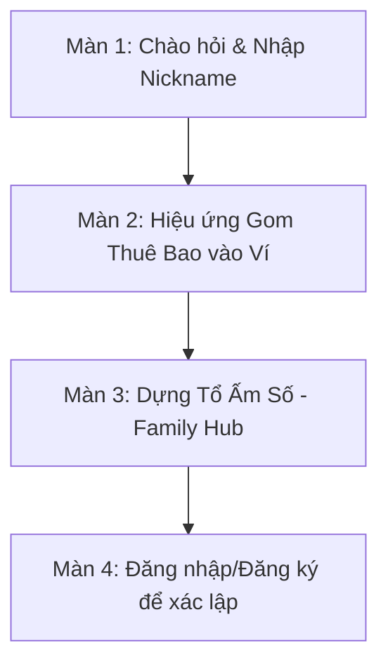
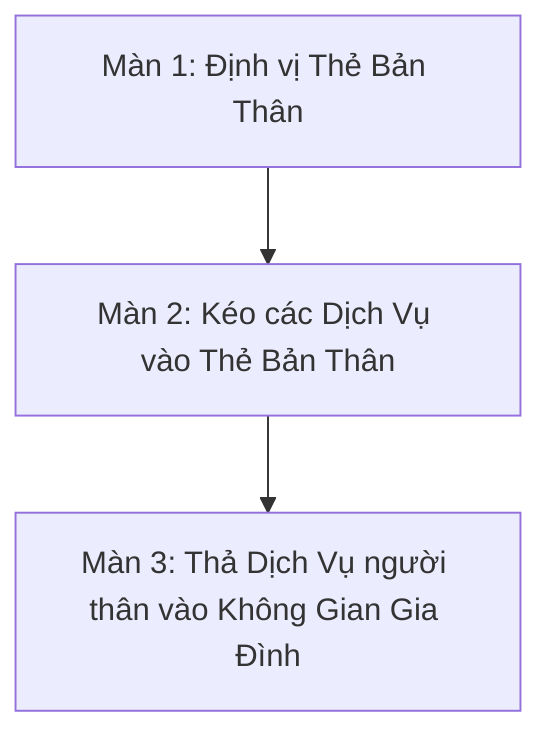
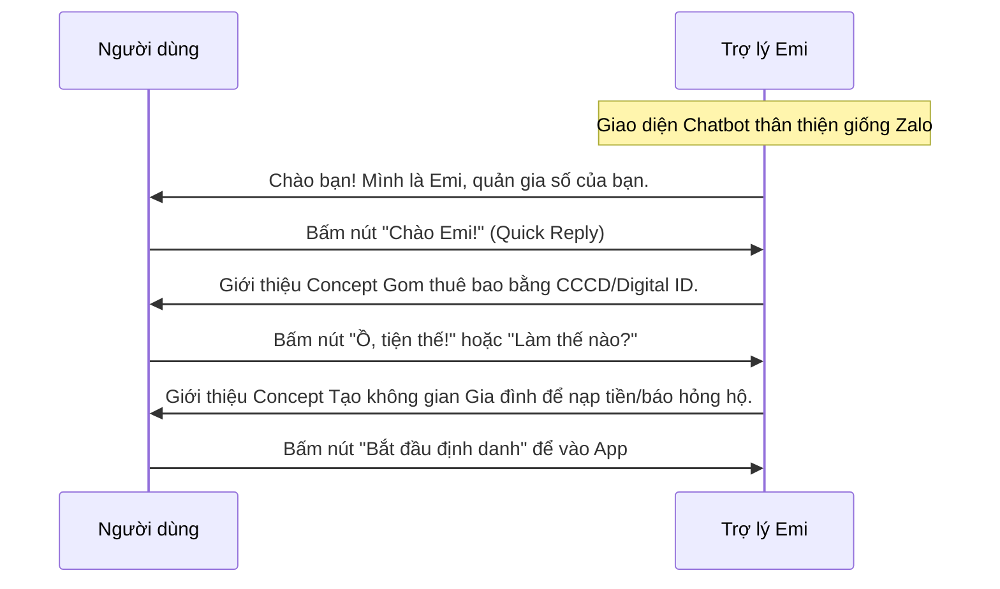

# ĐỀ XUẤT PHƯƠNG ÁN: LUỒNG ONBOARDING SÁNG TẠO - SUPER APP MYVNPT (EMIOS)

Tài liệu này đề xuất **3 phương án (kịch bản) thiết kế trải nghiệm Onboarding** cho người dùng cài đặt ứng dụng MyVNPT lần đầu. Mục tiêu cốt lõi là xóa bỏ tư duy "Quản lý theo số thuê bao/hợp đồng" kiểu cũ, giáo dục người dùng về hai triết lý mới của hệ điều hành Emi OS:
1. **Human-Centric Identity (Định danh lấy con người làm trung tâm):** Một người dùng sở hữu và quản lý tập trung nhiều tài sản số (SIM, Fiber, MyTV).
2. **Family Hub (Không gian Hộ gia đình):** Kết nối các cá nhân thành nhóm gia đình để chia sẻ tài nguyên và hỗ trợ quản lý hộ mà vẫn đảm bảo tính riêng tư.

---

## 🎨 MA TRẬN SO SÁNH NHANH 3 PHƯƠNG ÁN

| Tiêu chí đánh giá | Phương án 1: Nhập vai tương tác (Storytelling) | Phương án 2: Kéo thả vật lý (Living Canvas) | Phương án 3: Hội thoại hóa (Conversational) |
| :--- | :--- | :--- | :--- |
| **Mức độ WOW thị giác** | ⭐⭐⭐⭐⭐ (Rất cao - Lottie/3D Animation) | ⭐⭐⭐⭐☆ (Cao - Hiệu ứng vật lý) | ⭐⭐⭐☆☆ (Trung bình - Thân thiện, quen thuộc) |
| **Độ phức tạp phát triển (Dev)** | Cao (Cần tối ưu dung lượng animation) | Rất cao (Cần thư viện kéo thả & mượt mà) | Thấp (Sử dụng cấu trúc tin nhắn Chat UI tiêu chuẩn) |
| **Tỉ lệ hoàn thành luồng (Completion)**| Khá (3 bước trực quan) | Trung bình (Cần hướng dẫn cụ thể để kéo thả) | Rất cao (Người dùng chỉ cần chạm nút gợi ý) |
| **Phù hợp nhất với tệp KH** | Khách hàng trẻ & Ưa thích sự hiện đại | Khách hàng công nghệ, thích trực quan | Khách hàng đại chúng, người lớn tuổi (Zero-tech) |

---

## 🚀 CHI TIẾT 3 PHƯƠNG ÁN THIẾT KẾ

### PHƯƠNG ÁN 1: Interactive Storytelling & Identity Hub (Kịch bản Nhập vai Tương tác)
*Ý tưởng chủ đạo: Sử dụng trợ lý ảo Emi làm nhân vật dẫn đường, biến việc tìm hiểu tính năng thành một câu chuyện ngắn đầy cảm xúc.*

#### Chi tiết các màn hình thao tác:
*   **Màn hình 1: Thiết lập Danh tính cá nhân**
    *   **Visual:** Trợ lý Emi (dạng 3D/Lottie hoạt họa) xuất hiện sinh động ở trung tâm, vẫy tay chào người dùng. Nền tối (Dark Mode) phối màu tím Neon & xanh mint thời thượng.
    *   **UX Copywriting (Emi Speak-out):** 
        *   *"Xin chào! Mình là Emi, trợ lý số của riêng bạn. Trước khi bắt đầu hành trình mới, bạn muốn Emi gọi bạn là gì thế?"*
    *   **Tương tác:** Một ô nhập text nhỏ gọn hiện lên kèm bàn phím. Người dùng nhập tên/nickname (Ví dụ: "Minh An").
*   **Màn hình 2: Hiện thực hóa "Hợp nhất Thuê bao" (Identity Wallet)**
    *   **Visual:** Sau khi người dùng nhập tên, Emi sẽ hô biến ra một chiếc ví da số (Digital Wallet) phát sáng mang tên người dùng. Phía trên bay lơ lửng các bong bóng biểu tượng đại diện cho SIM Di động, Mạng Internet, Truyền hình MyTV.
    *   **UX Copywriting (Emi Speak-out):**
        *   *"Chào [Minh An]! Emi biết bạn đang dùng rất nhiều dịch vụ của VNPT. Từ nay, không cần phải nhớ hàng tá mật khẩu hay số thuê bao nữa. Chỉ cần một danh tính [Minh An], Emi sẽ tự động gom hết tất cả 'tài sản số' này xếp gọn vào chiếc ví này của bạn nhé!"*
    *   **Tương tác:** Bong bóng tự động bay và chui vào trong ví với hiệu ứng âm thanh/haptic phản hồi cực kỳ mượt mà.
*   **Màn hình 3: Mở rộng Không gian Gia đình (Family Hub)**
    *   **Visual:** Chiếc ví thu nhỏ lại và đặt vào góc trái. Một sơ đồ "Ngôi nhà số" (Family Hub) xuất hiện ở trung tâm với các vị trí trống được thiết kế dạng khung ảnh trống (avatar placeholder) kèm nhãn "Bố mẹ", "Con cái".
    *   **UX Copywriting (Emi Speak-out):**
        *   *"Gia đình là nơi để sẻ chia. Bạn có muốn Emi giúp bạn tạo một không gian gia đình để cùng chia sẻ Data, hoặc giúp đóng cước mạng thay cho bố mẹ chỉ trong 1 chạm không?"*
    *   **Tương tác:** Người dùng bấm nút hành động *"Trải nghiệm ngay"* hoặc *"Bỏ qua"*.

---

### PHƯƠNG ÁN 2: The Drag & Drop Living Canvas (Kịch bản Tương tác Kéo Thả Vật Lý)
*Ý tưởng chủ đạo: Cho người dùng trực tiếp "chạm" và cảm nhận mối quan hệ thực thể bằng thao tác kéo thả cơ học.*

#### Chi tiết các màn hình thao tác:
*   **Màn hình 1: Thẻ bản thân (Identity Card)**
    *   **Visual:** Giao diện tối giản phong cách Glassmorphism. Một thẻ tròn đại diện cho "Tôi" nằm ở tâm màn hình.
    *   **UX Copywriting (Emi Speak-out):** 
        *   *"Mọi hành trình số đều bắt đầu từ bạn. Đây là trung tâm quản lý dịch vụ của riêng bạn."*
*   **Màn hình 2: Trải nghiệm kéo thả gom dịch vụ**
    *   **Visual:** 3-4 bong bóng (Bubble) dịch vụ đại diện cho các số thuê bao di động, wifi nhà riêng, truyền hình xuất hiện trôi nổi tự do (hiệu ứng vật lý nảy nhẹ).
    *   **UX Copywriting (Emi Speak-out):**
        *   *"Hãy thử kéo các bong bóng dịch vụ này thả vào Thẻ của bạn để gom tất cả về một mối quản lý thống nhất!"*
    *   **Tương tác (Gamification):** Người dùng dùng ngón tay kéo từng bong bóng thả vào thẻ trung tâm. Khi bong bóng chạm thẻ, thẻ sẽ phát ra một vòng sóng ánh sáng lan tỏa (Ripple Effect) kèm haptic báo hiệu tích hợp thành công.
*   **Màn hình 3: Mở rộng Hộ gia đình**
    *   **Visual:** Xuất hiện thêm một vùng bao quanh gọi là "Không gian Hộ gia đình" (Home Zone).
    *   **UX Copywriting (Emi Speak-out):**
        *   *"Bây giờ, hãy kéo dịch vụ Internet của bố mẹ thả vào vùng Hộ gia đình để giúp bố mẹ quản trị mạng và thanh toán cước hàng tháng nhé."*
    *   **Tương tác:** Người dùng kéo thả và hoàn tất.

---

### PHƯƠNG ÁN 3: Conversational Chatbot Setup (Kịch bản Hội thoại Hóa Emi-First)
*Ý tưởng chủ đạo: Tận dụng giao diện Chat quen thuộc để tạo sự gần gũi, loại bỏ hoàn toàn cảm giác "cài đặt app phức tạp" đối với người dùng không rành công nghệ.*

#### Chi tiết các màn hình thao tác:
*   **Màn hình 1: Lời chào và Thiết lập nhân cách**
    *   **Visual:** Trông như một khung chat thời gian thực. Tin nhắn từ Emi chạy ra kèm hiệu ứng gõ chữ (typing indicator).
    *   **UX Copywriting (Emi Speak-out):** 
        *   *Emi:* *"Chào bạn thân mến! Mình là Emi, quản gia trải nghiệm số của bạn tại MyVNPT. Rất vui được gặp bạn! 😊"*
        *   *Nút Quick Reply cho User chọn:* `[Chào Emi!]` | `[App mới có gì hay?]`
*   **Màn hình 2: Giải thích "Gom thuê bao về cá nhân"**
    *   **Visual:** Emi gửi một bức ảnh minh họa hoạt họa siêu dễ thương kèm nội dung chat.
    *   **UX Copywriting (Emi Speak-out):**
        *   *Emi:* *"Từ phiên bản này, MyVNPT sẽ không quản lý theo số SIM khô khan nữa. Chỉ cần bạn quét CCCD một lần duy nhất, Emi sẽ tự động nhận diện và gom toàn bộ SIM, mạng Wifi nhà bạn đang đứng tên về chung một chỗ."*
        *   *Nút Quick Reply cho User chọn:* `[Tiện quá!]` | `[Còn gì nữa không?]`
*   **Màn hình 3: Giải thích "Quản lý Hộ gia đình"**
    *   **Visual:** Emi gửi một sơ đồ gia đình được vẽ dưới dạng icon các thành viên dễ thương.
    *   **UX Copywriting (Emi Speak-out):**
        *   *Emi:* *"Đặc biệt hơn, Emi đã chuẩn bị sẵn một 'Không gian gia đình'. Bạn có thể mời bố mẹ hoặc con cái tham gia để đóng hộ tiền mạng, chia sẻ dung lượng Data hoặc gửi yêu cầu báo hỏng Internet thay cho người thân khi gặp sự cố."*
        *   *Nút Quick Reply cho User chọn:* `[Bắt đầu khám phá ngay]`
    *   **Tương tác:** Bấm nút sẽ chuyển sang màn hình Đăng nhập/Định danh nhanh để vào ứng dụng.

---

## 💡 ĐỀ XUẤT LỰA CHỌN TỪ CHUYÊN GIA (RECOMMENDATION)

Để đảm bảo vừa mang lại yếu tố **WOW thị giác** vừa giữ được **tỉ lệ hoàn thành luồng cao (không làm người dùng bỏ cuộc giữa chừng)**, chúng tôi đề xuất **Phương án 1 (Interactive Storytelling)** kết hợp một chút yếu tố của **Phương án 3 (Hội thoại)**:
*   **Giai đoạn giới thiệu khái niệm:** Sử dụng Animation Lottie mượt mà của **Phương án 1** để mô phỏng sinh động hành động Gom thuê bao vào ví và tạo lập Ngôi nhà số.
*   **Giai đoạn kích hoạt:** Sử dụng các nút bấm Quick Reply thân thiện của **Phương án 3** để dẫn dắt tự nhiên sang luồng đăng nhập bằng Sinh trắc học hoặc CCCD/VNeID.
