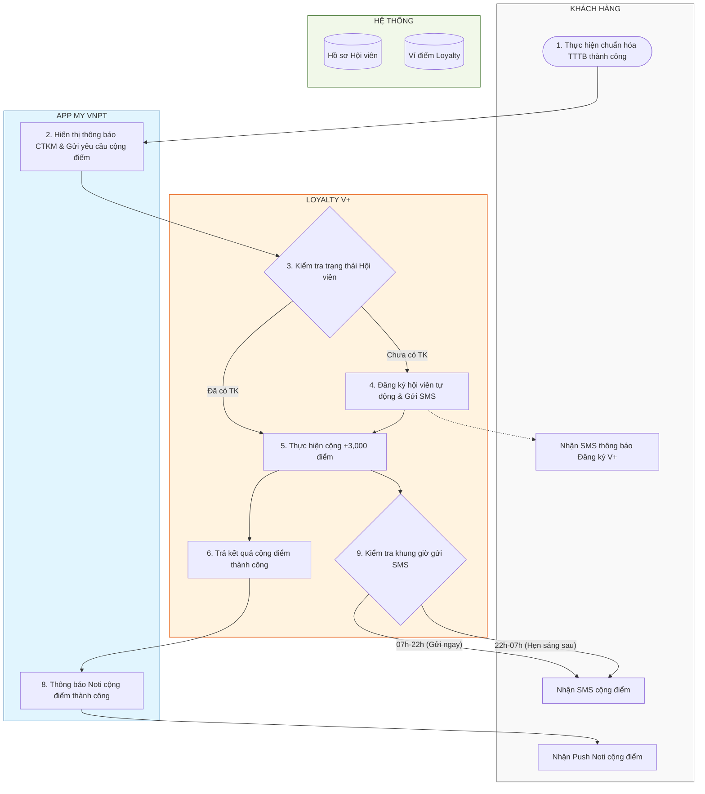
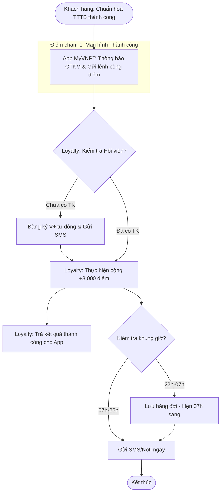

# [SPEC-001] Chương trình Tặng điểm VinaPhone Plus khi Chuẩn hóa Thông tin Thuê bao (C06)

## Metadata
- **Mã Index**: SPEC-001
- **Phiên bản**: 1.0.0
- **Ngày cập nhật**: 2026-03-05
- **Người thực hiện**: Antigravity (AI Business Analyst)
- **Trình trạng**: Dự thảo (Chờ Approved)

---

## 1. Bối cảnh & Mục tiêu (Business)
### 1.1. Bối cảnh
Thực hiện chiến dịch Chuẩn hóa thông tin thuê bao theo nghị định C06. Cần có cơ chế khuyến khích (Incentive) để khách hàng chủ động thực hiện chuẩn hóa trên ứng dụng My VNPT.

### 1.2. Mục tiêu
- Gia tăng tỷ lệ khách hàng hoàn thành chuẩn hóa thông tin thuê bao (TTTB).
- Thúc đẩy trải nghiệm các tính năng trên App My VNPT và hệ sinh thái VinaPhone Plus.
- Tặng 3.000 điểm VinaPhone Plus cho mỗi lần chuẩn hóa thành công.

---

## 2. Trải nghiệm người dùng & Copy (UX/UI)
### 2.1. Luồng trải nghiệm (Flow)
1. **Hoàn thành:** Khách hàng thực hiện chuẩn hóa TTTB thành công.
2. **Landing Success:** Hệ thống hiển thị màn hình thông báo thành công kèm box quà tặng.
3. **Onboarding:** Giới thiệu các tính năng App và gợi ý đổi quà ngay tại chỗ.

### 2.2. Nội dung hiển thị (Copywriting)
- **Tiêu đề Success:** "Xác thực thông tin thuê bao thành công"
- **Box quà tặng:** "Bạn được tặng +3.000 điểm VinaPhone Plus"
- **Nội dung phụ:** "Điểm dùng để đổi vô vàn ưu đãi hấp dẫn. Khám phá ngay"

---

## 3. Quy trình Step-by-step & Rule Hệ thống
### 3.1. Quy trình chi tiết (User Flow - Swimlanes)

#### 📊 Bảng mô tả trình tự tương tác hệ thống (Sequence Logic)

| STT | Đối tượng gửi | Đối tượng nhận | Hành động / Dữ liệu trao đổi | Ghi chú nghiệp vụ |
| :-- | :--- | :--- | :--- | :--- |
| **1** | **Khách hàng** | **MyVNPT** | Thực hiện Chuẩn hóa TTTB thành công. | |
| **2** | **MyVNPT** | **Loyalty (V+)** | Gửi yêu cầu cộng điểm. Hiển thị thông báo CTKM (nếu có chương trình cấu hình). | **Điểm chạm 1:** Màn hình cập nhật thông tin thuê bao Thành công. |
| **3** | **Loyalty** | **Hệ thống** | Kiểm tra trạng thái Hội viên. | |
| **4** | **Loyalty** | **Khách hàng** | Đăng ký hội viên tự động & Gửi SMS thông báo (Nếu chưa có TK). | |
| **5** | **Loyalty** | **Hệ thống** | Thực hiện cộng **+3,000 điểm** vào TK. | |
| **6** | **Loyalty** | **App MyVNPT** | Trả kết quả cộng điểm thành công. | |
| **8** | **Loyalty (V+)** | **SMS/Noti** | Kiểm tra khung giờ: (07h-22h: Gửi ngay), (22h-07h: Hẹn sáng sau). | **Batch Job:** Đảm bảo không làm phiền khách hàng ban đêm. |

### 3.2. Sơ đồ luồng người dùng (User Flow)

1. **Bước 1:** Khách hàng Login -> Thực hiện chuẩn hóa TTTB thành công.
2. **Bước 2:** Hệ thống My VNPT gọi sang hệ thống VinaPhone Plus để kiểm tra:
   - **Nếu chưa là hội viên:** Lấy thông tin từ CCBS để tự động đăng ký hội viên -> Nhắn tin SMS thông báo đăng ký thành công -> Cộng 3.000 điểm.
   - **Nếu đã là hội viên:** Thực hiện cộng 3.000 điểm trực tiếp.
3. **Bước 3:** Gửi Noti/SMS cho khách hàng thông báo về việc nhận điểm.

### 3.2. Business Rules (Quan trọng)
- **Giới hạn:** Mỗi khách hàng (1 SĐT) nhận tối đa **01 lần** ưu đãi trong suốt chương trình.
- **Thời gian cộng điểm:** 
  - Giao dịch từ 7h - 22h: Cộng điểm và gửi thông báo ngay.
  - Giao dịch sau 22h: Cộng điểm và giữ lại thông báo, gửi vào 7h sáng hôm sau (tránh làm phiền khách hàng).
- **Quy tắc hiển thị Voucher (UI Task):**
  - Chỉ hiển thị các voucher có giá trị đổi điểm **<= 3.000**.
  - Sắp xếp thứ tự: Điểm thấp -> Điểm cao.
  - Thứ tự ưu tiên loại quà: **Gói cước** => **Voucher** => **Quà tặng phẩm**.
  - Số lượng hiển thị: Tối đa **5 voucher**. Có nút "Xem thêm" dẫn link vào V+.

---

### 3.3. Đặc tả chi tiết các thành phần giao diện (UI/UX Spec Table)

| Thành phần UI | Khi nào hiển thị? (Condition) | Quy tắc nội dung & Dữ liệu (Rules) | Hành động khi Click (Action) |
| :--- | :--- | :--- | :--- |
| **1. Box Quà tặng** | • Cập nhật TTTB thành công (Status = Success).   • Có chiến dịch tặng điểm đang **Active**. | • **Nội dung:** Fix cứng theo thiết kế UI (Icon + Text tặng +3,000 điểm).   • **Ưu tiên:** Nếu có >01 chương trình cùng chạy, ưu tiên chương trình có **Trọng số cao nhất** (Config trên CMS). | Chuyển hướng (Deep-link) vào **màn hình chính VinaPhone Plus**. |
| **2. Box Tên & SĐT** | Luôn hiển thị khi xác thực thành công. | • Lấy dữ liệu **Họ tên** và **SĐT** real-time từ hệ thống CCBS sau khi vừa chuẩn hóa. | N/A (Chỉ hiển thị thông tin). |
| **3. Khu vực Ưu đãi (Carousel)** | • Cập nhật TTTB thành công.   • Có chương trình tặng điểm đang chạy. | • **Quy tắc ưu tiên chương trình:** Đồng nhất với Box Quà tặng phía trên.   • **Hình thức:** Hiển thị dạng thẻ (Card) vuốt ngang. | Click vào thẻ quà: Dẫn vào màn **Chi tiết quà tặng** tương ứng trong V+. |
| **4. Logic Hiển thị Voucher** (Bên trong Carousel) | *Nằm trong Khu vực Ưu đãi* | • **Bộ lọc:** Chỉ hiển thị ưu đãi có mức đổi điểm **≤ [Số điểm tặng của chương trình]** (Cấu hình động).   • **Số lượng:** Tối đa **05 vouchers**.   • **Sắp xếp:** Điểm đổi từ **Thấp đến Cao**. | Click nút **"Xem thêm"**: Dẫn vào màn danh sách quà tặng của **VinaPhone Plus**. |
| **5. Thứ tự Ưu tiên Quà** | *Nằm trong Khu vực Ưu đãi* | Ưu tiên lấy theo loại (Type):   **Gói cước** (Data/Thoại) -> **Voucher** (Mua sắm/Ăn uống) -> **Quà phẩm**. | N/A |
| **6. Nút "Về trang chủ"** | Luôn hiển thị ở dưới cùng màn hình. | Fix cứng text và style theo thiết kế. | Quay lại **Màn hình Dashboard chính** của App My VNPT. |

---

#### 💡 Ghi chú Kỹ thuật (Technical Notes):
1. **Tính động (Dynamic):** Số điểm tặng (ví dụ 3.000) và danh sách voucher phải được lấy từ API, không được fix cứng để có thể thay đổi theo từng chiến dịch khác nhau.
2. **Trường hợp rỗng (Empty Case):** Nếu không có voucher nào thỏa mãn điều kiện `≤ [Số điểm tặng]`, hệ thống sẽ ẩn toàn bộ mục **"Khám phá thêm các ưu đãi"** và chỉ hiển thị Box Quà tặng cùng nút "Về trang chủ".
3. **Tracking:** Gắn tag tracking cho các điểm chạm (Box Quà tặng, từng thẻ Voucher, nút Xem thêm, nút Về trang chủ) để đo lường hiệu quả chương trình.

---

## 4. Đặc tả Truyền thông (Communication)
### 4.1. Nội dung Push Notification
- **Tiêu đề:** ❤️ Bạn nhận được 3000 điểm VinaPhone Plus
- **Nội dung:** 🥳 Chúc mừng bạn đã xác thực thông tin thuê bao thành công. My VNPT tặng bạn 3000 điểm VinaPhone Plus. Đổi điểm ngay để nhận data, phút gọi, voucher ăn uống, du lịch... 👉 Thời hạn điểm đến ngày [dd/mm/yyyy].

### 4.2. Nội dung SMS
- **Nội dung:** (CSKH) Chuc mung ban da xac thuc thong tin thue bao thanh cong. My VNPT kinh tang ban 3000 diem VinaPhone Plus. Diem tang co thoi han den [dd/mm/yyyy] de trai nghiem cac uu dai (qua tang, phut goi, Data...) tai website/ung dung My VNPT https://my.vnpt.com.vn/adv/vplus. CSKH 18001091 (0d). Tran trong!

---

## 5. Đặc tả Event Tracking (CJM MyVNPT Standard)

| Luồng | Tên màn hình | ID | Trigger | Event Name | Param Name | Operator | Param Value |
| :--- | :--- | :---: | :--- | :--- | :--- | :---: | :--- |
| **CTKM C06** | kyc_reward_onboard | **RE1** | Hiển thị màn thành công & box tặng điểm | `service_block_displayed` | partnerName   screenName   blockName   blockType | =   =   =   = | myvnpt   kyc_reward_onboard   reward_points_box   block |
| **CTKM C06** | kyc_reward_onboard | **RE2** | Click Box thông báo tặng điểm (Toàn bộ box) | `service_block_clicked` | partnerName   screenName   blockName   blockType | =   =   =   = | myvnpt   kyc_reward_onboard   reward_points_box   block |
| **CTKM C06** | kyc_reward_onboard | **RE3** | Click vào thẻ Voucher trong Carousel | `service_item_selected` | partnerName   screenName   listName   itemValue   itemType | =   =   =   =   IN SET | myvnpt   kyc_reward_onboard   voucher_carousel   [mã_voucher]   <data/gift/voucher> |
| **CTKM C06** | kyc_reward_onboard | **RE4** | Click nút "Xem thêm" vào V+ | `service_button_clicked` | partnerName   screenName   buttonName | =   =   = | myvnpt   kyc_reward_onboard   view_more_vplus |
| **CTKM C06** | kyc_reward_onboard | **RE5** | App thực hiện call API cộng điểm | `ops_request_be` | partnerName   screenName   apiName | =   =   = | myvnpt   kyc_reward_onboard   add_loyalty_points_c06 |
| **CTKM C06** | kyc_reward_onboard | **RE6** | Nhận phản hồi API cộng điểm | `ops_receive_be` | partnerName   screenName   apiName   duration   status   errorCode | =   =   =   =   IN SET   = | myvnpt   kyc_reward_onboard   add_loyalty_points_c06   [ms]   <0: Success, 1: Fail>   [status_code] |

---

## 6. Vận hành & Testing
- **Kiểm tra đăng ký hội viên tự động:** Đảm bảo thuê bao mới/ngoại mạng được tạo tài khoản V+ thành công trước khi cộng điểm.
- **Kiểm tra chặn lặp:** Tránh cộng điểm 2 lần cho cùng 1 SĐT nếu khách hàng thao tác lại.
- **Kiểm tra hiển thị Voucher:** Đảm bảo không hiển thị Voucher > 3.000 điểm gây hụt hẫng cho khách hàng.
- **Validation CJM Log:** Đội QC thực hiện bắt log proxy (Fiddler/Charles) để verify các Event Name và Param Value bên trên khớp 100% với Spec.
