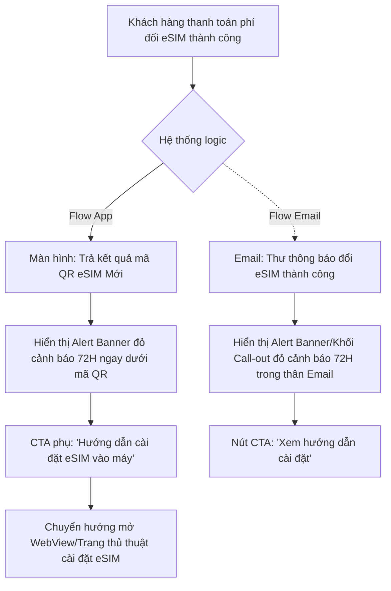

# Điều chỉnh nghiệp vụ đổi eSIM trên My VNPT (Cảnh báo 72H)
- **Link Google Docs:** [URD01_IT360-1585542_Dieu_chinh_nghiep_vu_doi_eSIM](https://docs.google.com/document/d/1hIHdvnWdvRby94h41I2-fkJJLBi9ljGDNgJVMuatxdU/edit)
**Phiên bản (Version):** v1.0
**Ngày bắt đầu:** 11/03/2026
**Người làm (Owner):** UX Designer & Writer (AI Agent)

---

## Phần I: Bối cảnh & Mục tiêu (Business Perspective)
- **Mục tiêu kinh doanh (Business Goals):** Mở rộng tính minh bạch trong chính sách Đổi eSIM trực tuyến. Giảm thiểu các khiếu nại bồi thường không đáng có từ phía người dùng do lộ mã QR hoặc để mã hết hạn. Tối đa hóa tỷ lệ khách hàng quét eSIM vào máy thành công ngay lập tức sau khi lấy mã.
- **Lộ trình triển khai (Rollout Plan):** 
  - Triển khai đồng thời trên App My VNPT (Version kế tiếp) và hệ thống Template Gửi Mail tự động.

---

## Phần II: Đo lường & Chỉ số (Metrics)
- **Cơ chế đo lường (Measurement mechanism):** App Analytics (Firebase/Mixpanel) và Hệ thống Email Tracking.
- **Chỉ số Bắc đẩu (North star):** Tỷ lệ khách hàng đưa (quét) eSIM vào thiết bị thành công trong vòng 24H đầu tiên.
- **Chỉ số Thành công (Success metrics):** Tỷ lệ Click vào CTA "Hướng dẫn cài đặt eSIM vào máy" tại màn hình báo Thành công.
- **Các chỉ số khác (Other metrics):** Số lượng cuộc gọi khiếu nại lên tổng đài 18001091 liên quan đến lỗi mã QR eSIM (Kỳ vọng giảm).
- **Tracking & Analytics:** Gắn tracking event `click_esim_guideline` tại Alert Banner trên App My VNPT.

---

## Phần III: Trải nghiệm Người dùng (UX & Copywriting)
- **User Stories (Hành trình):** 
  - Là một khách hàng vừa mua xong eSIM online, tôi muốn được cảnh báo rõ ràng về thời hạn hiệu lực của mã QR và rủi ro bảo mật để tôi có ý thức cài đặt nó ngay lập tức thay vì quên lãng.
- **Sơ đồ UX (User Flow / Wireframe):** 

- **Copywriting (Nội dung thấu cảm):**
  - **Banner Cảnh bảo (My VNPT & Body Email):** "Quý khách lưu ý cài đặt eSIM mới ngay sau khi nhận QR code thành công để tránh rủi ro lộ thông tin. VNPT VinaPhone chỉ chịu trách nhiệm giải quyết khiếu nại trong vòng **72 GIỜ** kể từ thời điểm nhận mã. Chi tiết liên hệ: **18001091 (0đ)**."
  - **Tên nút bấm (CTA phụ):** "👉 Bấm xem Hướng dẫn cài đặt eSIM vào máy" (Điều hướng đến mục Trợ giúp).

---

## Phần IV: Quy trình & Đặc tả Kỹ thuật (Master Flow & Logic)
| Bước | Mã màn hình | Giao diện | Điểm chạm (Touch-point) | Hành động (User Action) | Phản hồi Hệ thống & UI (System/UI Response) | Quy tắc nghiệp vụ & Logic (Backend/Logic Rules) |
|---|---|---|---|---|---|---|
| 1 | `APP_ESIM_SUCCESS` | Màn hình Trả kết quả có mã QR | Khối Alert Banner (Đỏ/Cam) nằm ngay dưới QR | User vuốt đọc thông tin trả về sau khi thanh toán xong. | Hiển thị Banner cảnh báo chiếm toàn bộ chiều ngang màn hình. Không có nút (X) để bấm ẩn Banner đi. | Từ khóa '72 GIỜ' và sđt '18001091' bắt buộc phải format in đậm (Bold) hoặc đổi màu nhấn. |
| 2 | `APP_ESIM_SUCCESS` | Dưới khối Alert Banner | Nút CTA Outlined / Text Link | User bấm "Hướng dẫn cài đặt eSIM vào máy" | Hệ thống mở Modal hoặc WebView hướng dẫn các bước cài eSIM cho thiết bị iOS/Android. |  |
| 3 | `SYS_EMAIL_TEMPL` | Email Template (Đổi eSIM) | Khối Call-out đỏ (table HTML) | User mở hộp thư đến để xem mã QR | Hiển thị box thông báo tương tự trên App. Formatted chuẩn HTML email (fallback tốt). | Tránh dùng style CSS phức tạp, ưu tiên inline-CSS cơ bản để mọi app Mail (Gmail, Outlook) đều parse được. |

- **Xử lý Ngoại lệ (Edge Cases / Exception Handling):** 
  - Với Email client phiên bản cũ không hỗ trợ render UI khối Alert: Chắc chắn Text thô (Plain Text) vẫn giữ nguyên được các cụm từ IN HOA như 72 GIỜ.

---

## Phần V: Kiểm thử & Vận hành (Testing/Operation)
- **Kịch bản Test (Test Scenarios):** 
  - Pass QA Design: Test màu sắc Banner Cảnh báo trên cả Light Mode và Dark Mode của My VNPT để đảm bảo chữ không bị chìm.
  - Test nhận Email trên ứng dụng Gmail (Mobile) và Outlook (Desktop) để coi khung HTML có bị méo không.
- **Cấu hình CMS/Admin:** 
  - (Tùy chọn) Có thể thiết kế CMS cho phép thay đổi cấu hình con số "72 GIỜ" này sau này nếu chính sách bồi thường thay đổi. Mặc định hiện tại là 72H.

<!-- gdoc_id: 1hIHdvnWdvRby94h41I2-fkJJLBi9ljGDNgJVMuatxdU -->
