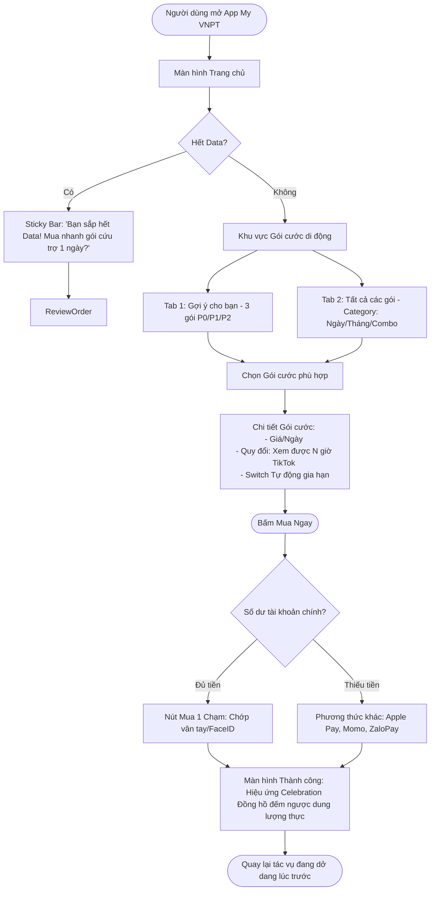
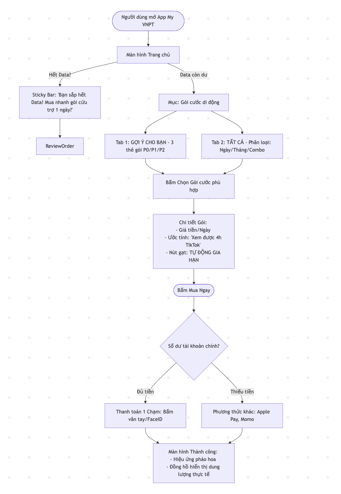

# Thiết kế Luồng Trải nghiệm Người dùng (UX Flow)
**Tính năng**: Mua gói cước di động
**Người chịu trách nhiệm (Role)**: UX (UX Designer)
**Dựa trên**: UR Research (JTBD & Competitor Insights)

---

## 1. Nguyên tắc thiết kế (Design Principles)
- **Minh bạch (Transparency)**: Hiển thị rõ giá, chu kỳ gia hạn, và dung lượng quy đổi sang thói quen (TikTok, Web).
- **Tốc độ (Speed)**: Giảm thiểu chạm, ưu tiên gói cước cá nhân hóa ngay màn hình đầu.
- **An tâm (Trust)**: Cho phép bật/tắt tự động gia hạn ngay tại bước xác nhận mua.

---

## 2. Sơ đồ luồng UX (User Flow Chart)

---

## 3. Mô tả các màn hình chính (Screens Breakdown)

### 3.1. Smart Selection (Màn hình Gợi ý)
- Thay vì danh sách 50 gói, UR Research đề xuất chỉ hiển thị 3 thẻ (Card) lớn:
    - **Gói 1 (Daily Fix):** Dành cho ai hay hết data dọc đường.
    - **Gói 2 (Social King):** Dành cho hệ người dùng xem YouTube/TikTok nhiều.
    - **Gói 3 (Economical Yearly):** Thuê bao muốn tiết kiệm dài hạn.

### 3.2. Plan Detail & Transparency (Độ minh bạch)
- Một thanh Switch **"Tự động gia hạn gói này"** nằm nổi bật ngay dưới nút Mua, mặc định theo thói quen người dùng nhưng không giấu giếm.
- Câu lệnh mô tả: *"Hệ thống sẽ cộng 2GB vào tài khoản. Tương đương với khoảng 4 tiếng xem video chất lượng cao."*

### 3.3. Celebration Success (Cảm xúc sau mua)
- Giai đoạn **Success** trong Design Thinking: Sau khi thanh toán xong, luồng không chỉ "thanh toán thành công" khô khan.
- Sẽ có hiệu ứng pháo hoa nhẹ và quan trọng nhất: Một **Widget thời gian thực** hiển thị: "Bạn đang có 2.00 GB/2.00 GB. Sẵn sàng lướt web!".

---
*Tài liệu này được lưu tại: `knowledge base/ux-design-output/ux/flow-buy-data-plan.md`*
